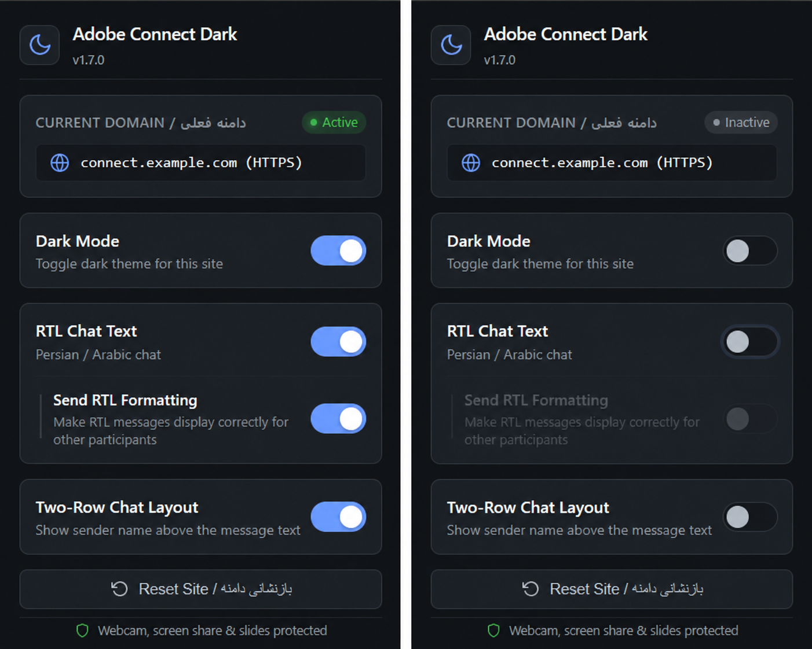
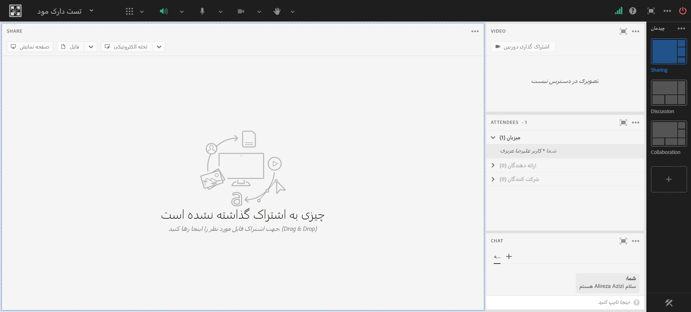
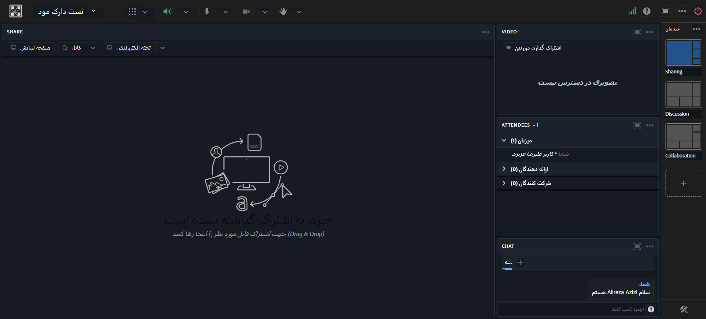
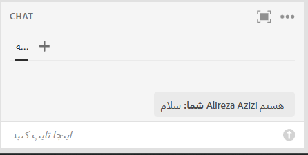
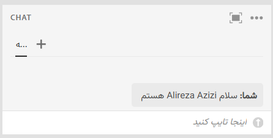
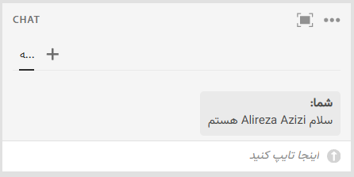

<a id="top"></a>
<div align="center">


# Adobe Connect Dark

### حالت تاریک پیشرفته، چت راست‌به‌چپ هوشمند و چیدمان دو سطری برای نسخه وب ادوبی کانکت

افزونه‌ای مدرن بر پایه معماری Manifest V3 برای مرورگرهای خانواده کرومیوم (Chromium) که بدون دستکاری و تغییر رنگ اسلایدها، فایل‌های PDF، وب‌کم، وایت‌برد و محتوای به‌اشتراک‌گذاشته‌شده، رابط کاربری ادوبی کانکت را به محیطی تیره، چشم‌نواز و خوانا تبدیل می‌کند.

[](#یادداشت‌های-انتشار-نسخه-185)
[](#معماری-فنی-و-محیط‌های-اجرایی)
[](#سازگاری-مرورگرها)
[](#سازگاری-مرورگرها)
[](#سازگاری-با-ادوبی-کانکت)

<br>

<div align="center">

[English](README.md) | **فارسی**

</div>

<br>

<p align="center">
  
</p>

<br>

**حالت تاریک · چت فارسی/عربی RTL · فرمت‌بندی ارسالی · چیدمان دو سطری چت · حفاظت از مدیا · دسترسی بر اساس تقاضا**

</div>

<div align="center">

<a href="#معرفی-افزونه"><strong>معرفی</strong></a> ·
<a href="#این-افزونه-چه-مشکلاتی-را-حل-میکند"><strong>مشکلات حل‌شده</strong></a> ·
<a href="#قابلیتهای-اصلی"><strong>قابلیت‌ها</strong></a> ·
<a href="#معماری-و-وابستگی-قابلیتها"><strong>معماری</strong></a> ·
<a href="#۲-چت-راست‌به‌چپ-rtl-chat-text"><strong>چت RTL</strong></a> ·
<a href="#راهنمای-نصب"><strong>نصب</strong></a> ·
<a href="#راهنمای-استفاده"><strong>استفاده</strong></a> ·
<a href="#تصاویر-محیط-برنامه"><strong>تصاویر</strong></a> ·
<a href="#یادداشت‌های-انتشار-نسخه-185"><strong>تغییرات اخیر</strong></a>

</div>

---

## دسترسی سریع به بخش‌ها

### آشنایی و کاربری
- [معرفی افزونه](#معرفی-افزونه)
- [این افزونه چه مشکلاتی را حل می‌کند؟](#این-افزونه-چه-مشکلاتی-را-حل-میکند)
- [تصاویر محیط برنامه](#تصاویر-محیط-برنامه)
- [قابلیت‌های اصلی](#قابلیتهای-اصلی)
- [معماری و وابستگی قابلیت‌ها](#معماری-و-وابستگی-قابلیتها)
- [بررسی دقیق قابلیت‌ها](#بررسی-دقیق-قابلیتها)
  - [۱. حالت تاریک (Dark Mode) و محافظت از محتوا](#۱-حالت-تاریک-dark-mode)
  - [۲. چت راست‌به‌چپ (RTL Chat Text)](#۲-چت-راست‌به‌چپ-rtl-chat-text)
  - [۳. فرمت‌بندی ارسالی (Send RTL Formatting)](#۳-فرمت‌بندی-ارسالی-send-rtl-formatting)
  - [۴. چیدمان دو سطری چت (Two-Row Chat Layout)](#۴-چیدمان-دو-سطری-چت-two-row-chat-layout)
- [کنترل‌ها و رابط کاربری پاپ‌آپ (Popup)](#کنترل‌ها-و-رابط-کاربری-پاپ‌آپ)
- [راهنمای نصب](#راهنمای-نصب)
- [راهنمای استفاده](#راهنمای-استفاده)

### معماری فنی و ساختار کد
- [تنظیمات پر-سایت و مدل ذخیره‌سازی](#تنظیمات-پر-سایت-و-مدل-ذخیره‌سازی)
- [معماری دسترسی بر اساس تقاضا (Permission-on-Demand)](#معماری-دسترسی-بر-اساس-تقاضا)
- [معماری فنی و محیط‌های اجرایی (ISOLATED و MAIN)](#معماری-فنی-و-محیط‌های-اجرایی)
- [پشتیبانی از Open Shadow DOM](#پشتیبانی-از-open-shadow-dom)
- [معماری حفاظت از محتوای جلسه و مدیا](#معماری-حفاظت-از-محتوای-جلسه-و-مدیا)
- [اتریبیوت‌های وضعیت در روت DOM](#اتریبیوت‌های-وضعیت-در-روت-dom)
- [ساختار فایل‌های پروژه](#ساختار-فایلهای-پروژه)
- [پوشش رابط کاربری Adobe Connect](#پوشش-رابط-کاربری-adobe-connect)

### سازگاری و قوانین پروژه
- [سازگاری مرورگرها](#سازگاری-مرورگرها)
- [سازگاری با ادوبی کانکت](#سازگاری-با-ادوبی-کانکت)
- [حریم خصوصی و امنیت](#حریم-خصوصی-و-امنیت)
- [محدودیت‌های شناخته‌شده](#محدودیتهای-شناخته‌شده)
- [عیب‌یابی (Troubleshooting)](#عیب‌یابی)
- [توسعه و مشارکت](#توسعه-و-مشارکت)
- [چک‌لیست تست دستی (QA)](#چک‌لیست-تست-دستی)
- [یادداشت‌های انتشار نسخه 1.8.5](#یادداشت‌های-انتشار-نسخه-185)
- [لایسنس و سلب مسئولیت](#لایسنس-و-سلب-مسئولیت)

---

<a id="معرفی-افزونه"></a>

## معرفی افزونه

نرم‌افزار Adobe Connect از دیرباز در دانشگاه‌ها، آموزشگاه‌ها، جلسات اداری، وبینارها و سیستم‌های بازپخش ویدیو مورد استفاده قرار می‌گیرد. با این وجود، حضور در جلسات طولانی‌مدت با رابط کاربری پیش‌فرض بسیار روشن و سفید می‌تواند به سرعت موجب خستگی چشم و کاهش تمرکز شود؛ به‌ویژه زمانی که محیط سیستم‌عامل و سایر برنامه‌های کاربر روی حالت تاریک (Dark Mode) تنظیم شده است.

**Adobe Connect Dark** رابط کاربری وب‌کلاینت ادوبی کانکت را به محیطی مدرن، لایه‌بندی‌شده و استاندارد با رنگ‌های تیره تبدیل می‌کند، در حالی که محتوای اصلی تدریس و ارائه بدون کمترین دستکاری حفظ می‌شود.

این افزونه عمداً **هیچ‌گونه** فیلتر معکوس‌کننده رنگ ساده (مانند فیلترهای `invert()` که کل صفحه را معکوس می‌کنند) به کار نمی‌برد. هسته قالب از استایل‌دهی دقیق اجزای نرم‌افزار، کدهای CSS ماژولار و مکانیزم‌های اسکن هوشمند بهره می‌برد تا پادها، سایدبارها، دیالوگ‌ها و منوها تاریک شوند، اما ارائه‌ها دقیقاً به همان شکلی که مدرس نشان می‌دهد باقی بمانند.

همچنین افزونه شامل یک موتور چت پیشرفته و مستقل برای زبان‌های راست‌به‌چپ (فارسی و عربی)، ابزار فرمت‌بندی هوشمند متون ارسالی و امکان نمایش دو سطری نام فرستنده و پیام در پاد چت است.

---

<a id="این-افزونه-چه-مشکلاتی-را-حل-میکند"></a>

## این افزونه چه مشکلاتی را حل می‌کند؟

| مشکل در وب‌کلاینت رسمی ادوبی کانکت | علت ریشه‌ای | راه‌حل در Adobe Connect Dark |
| :--- | :--- | :--- |
| **روشنایی شدید و خسته‌کننده** | رابط کاربری پیش‌فرض کاملاً سفید و پرنور است و در کلاس‌های طولانی باعث سوزش و خستگی چشم می‌شود. | **حالت تاریک مستقل (Dark Mode)**: اعمال پالت تیره با کنتراست استاندارد روی تمام پادها، نوارها، پنجره‌ها و گزینه‌ها. |
| **خراب شدن اسلایدها و ویدیوها در اکستنشن‌های معمولی** | افزونه‌های عمومی دارک‌مود، تمام صفحه را معکوس می‌کنند و در نتیجه تصاویر، اسلایدها، ویدیوهای وب‌کم و وایت‌برد غیرقابل‌خواندن یا نگاتیو می‌شوند. | **حفاظت هوشمند از مدیا (Content-Aware)**: استثنا کردن قطعی اسلایدها، اسکرین‌شیر، ویدیوها، فایل‌های PDF، بوم وایت‌برد و المان‌های گرافیکی SVG درس. |
| **بهم‌ریختگی متن‌های ترکیبی فارسی و انگلیسی** | هنگام تایپ متون آمیخته با اصطلاحات انگلیسی یا علائم نگارشی، کلمات جابه‌جا و پرانتزها و علامت سوال‌ها وارونه می‌شوند. | **چت هوشمند راست‌به‌چپ (RTL Chat Text)**: تفکیک خودکار جهت خطوط، ایزوله‌سازی فرمول‌های ریاضی و آغازگرهای انگلیسی. |
| **نمایش غلط پیام‌های فارسی برای سایر حاضران در جلسه** | وقتی کاربری پیام ترکیبی می‌فرستد، سایر شرکت‌کنندگان به دلیل نقص کلاینت رسمی ادوبی متن را وارونه مشاهده می‌کنند. | **فرمت‌بندی ارسالی (Send RTL Formatting)**: درج خودکار کدهای استاندارد یونیکد BiDi هنگام ارسال پیام تا متن برای سایرین هم درست نمایش یابد. |
| **شلوغی متن و نام فرستنده در یک خط چت** | قرارگیری نام فرستنده و پیام در یک خط باعث فشرده‌شدن و دشواری خواندن پیام‌های طولانی فارسی می‌شود. | **چیدمان دو سطری (Two-Row Chat Layout)**: تفکیک ساختار چت به دو سطر؛ سطر اول برای نام و زمان پیام و سطر دوم برای بدنه متن. |
| **درخواست دسترسی‌های فراتر از نیاز** | اکستنشن‌هایی که دسترسی به همه وب‌سایت‌ها را به‌صورت دائمی طلب می‌کنند ریسک‌های امنیتی و پرفورمنس ایجاد می‌کنند. | **معماری دسترسی بر اساس تقاضا (Permission-on-Demand)**: دسترسی به سایت تنها در زمان روشن کردن فیچر و صرفاً برای همان دامنه فعال می‌گردد. |

---

<a id="تصاویر-محیط-برنامه"></a>

## تصاویر محیط برنامه

### کنترل‌های پاپ‌آپ افزونه

<p align="center">
  
</p>

### مقایسه محیط کلاس (روشن در برابر حالت تاریک)

<p align="center">
  
  
</p>

### حالت‌های مختلف چیدمان و نمایش چت

<p align="center">
  
  
  
</p>

---

<a id="قابلیتهای-اصلی"></a>

## قابلیت‌های اصلی

| قابلیت | نوع ساختار | وظیفه و عملکرد |
| :--- | :---: | :--- |
| **Dark Mode** | سطح بالا (مستقل) | اعمال تم تیره روی پادها، نوار ابزار، سایدبارها، جدول‌ها و دیالوگ‌ها با حفظ کامل محتوای ارائه. |
| **RTL Chat Text** | سطح بالا (مستقل) | چیدمان راست‌به‌چپ برای زبان‌های فارسی/عربی، هدایت جهت خطوط، فونت وزیرمتن و تصحیح محلی متن چت. |
| **Send RTL Formatting** | زیرمجموعه (وابسته) | کدگذاری نامرئی یونیکد BiDi روی متون خروجی هنگام ارسال برای اصلاح نمایش نزد سایر کاربران. |
| **Two-Row Chat Layout** | سطح بالا (مستقل) | جداسازی نام فرستنده و ساعت پیام در سطر بالا، و متن پیام در سطر پایین از طریق CSS Grid. |
| **تنظیمات پر-سایت** | هسته مرکزی | ذخیره مستقل گزینه‌ها برای هر سرور یا دامنه (`protocol://hostname`). |
| **دسترسی بر اساس تقاضا** | امنیت | عدم درخواست دسترسی همگانی به اینترنت؛ اخذ مجوز مشروط فقط برای همان دامنه ادوبی کانکت. |
| **سازگار با SPA و تغییرات DOM** | موتور رندر | پشتیبانی کامل از باز و بسته شدن پادها و ایجاد پیام‌های جدید از طریق `MutationObserver`. |
| **پشتیبانی از Open Shadow DOM** | معماری | استایل‌دهی امن به اجزای قرارگرفته در درون روت‌های باز شَدو دام. |
| **حفاظت قطعی از محتوای آموزشی** | هسته استایل | جلوگیری از دستکاری رنگ اسلایدها، وب‌کم، پی‌دی‌اف، اسکرین‌شیر، وایت‌برد و تصاویر. |
| **همگام‌سازی خودکار (Self-Healing)**| پس‌زمینه | بررسی مداوم مجوزها و اسکریپت‌های ثبت‌شده در سرویس‌ورکر هنگام لود مرورگر جهت پیشگیری از خطاهای اجرایی. |
| **حریم خصوصی مطلق (Local-Only)** | حریم خصوصی | اجرای ۱۰۰٪ محلی بدون ارسال گزارش، بدون استفاده از ابزارهای آماری (Analytics) و بدون اسکریپت ریموت. |

---

<a id="معماری-و-وابستگی-قابلیتها"></a>

## معماری و وابستگی قابلیت‌ها

قابلیت‌های اکستنشن به عنوان واحدهای مستقل پیاده‌سازی شده‌اند، به جز فرمت‌بندی خروجی که منطقاً زیرشاخه چت راست‌به‌چپ است:

```text
Adobe Connect Dark (نسخه 1.8.2)
│
├── Dark Mode (مستقل)
│   └── فعال‌سازی بدون وابستگی به سایر گزینه‌ها
│
├── RTL Chat Text (مستقل)
│   ├── تشخیص جهت پیام‌های دریافتی (data-acd-bidi-dir)
│   ├── تایپ و فرمت‌بندی زنده در کامپوزر
│   └── Send RTL Formatting (زیرمجموعه وابسته)
│           └── منحصراً وابسته به فعال بودن RTL Chat Text
│
└── Two-Row Chat Layout (مستقل)
    └── فعال‌سازی بدون وابستگی به تم یا زبان
```

### ماتریس ترکیبی قابلیت‌ها

به دلیل استقلال این قابلیت‌ها، می‌توانید هر ترکیبی از آن‌ها را فعال کنید:

| Dark Mode | RTL Chat Text | Send RTL Formatting | Two-Row Layout | خروجی واقعی در صفحه |
| :---: | :---: | :---: | :---: | :--- |
| **خاموش** | **خاموش** | غیرفعال | **خاموش** | محیط پیش‌فرض ادوبی کانکت بدون تغییر. |
| **خاموش** | **خاموش** | غیرفعال | **روشن** | تم روشن رسمی ادوبی + چیدمان دو سطری در پاد چت. |
| **روشن** | **خاموش** | غیرفعال | **خاموش** | محیط تمام دارک با چت پیش‌فرض تک‌سطری. |
| **خاموش** | **روشن** | خاموش | **خاموش** | تم روشن رسمی + چت فارسی راست‌به‌چپ (متن خروجی بدون دستکاری ارسال می‌شود). |
| **خاموش** | **روشن** | روشن | **خاموش** | تم روشن رسمی + چت فارسی + فرمت‌بندی یونیکد ارسالی برای سایر حاضران. |
| **خاموش** | **روشن** | روشن | **روشن** | تم روشن رسمی + چت فارسی + فرمت‌بندی ارسالی + چیدمان دو سطری پیام‌ها. |
| **روشن** | **روشن** | خاموش | **روشن** | تم تاریک کامل + چت فارسی + چیدمان دو سطری (ارسال متن خام بدون کدهای یونیکد). |
| **روشن** | **روشن** | روشن | **روشن** | تم تاریک کامل + چت فارسی + فرمت‌بندی ارسالی + چیدمان دو سطری پیام‌ها. |

> [!NOTE]
> نشانگر وضعیت در پاپ‌آپ زمانی به حالت **Active** (آبی‌رنگ) درمی‌آید که حداقل یکی از سه قابلیت اصلی (**Dark Mode**، **RTL Chat Text** یا **Two-Row Chat Layout**) فعال باشد.

---

<a id="بررسی-دقیق-قابلیتها"></a>

## بررسی دقیق قابلیت‌ها

<a id="۱-حالت-تاریک-dark-mode"></a>

### ۱. حالت تاریک (Dark Mode)

حالت تاریک یک قابلیت مستقل است که متناسب با ساختار فرانت‌اند ادوبی کانکت توسعه یافته است:

- **رویکرد غیرتخریبی**: به جای استفاده از فیلترهای وارونه‌ساز تصویر، از مجموعه‌ای از قوانین دقیق CSS برای پوشش پادها، نوار منوها، دکمه‌ها و فرم‌ها استفاده می‌کند.
- **موتور آزمایشی Dark Reader و تم‌های از پیش آماده (`1.8.5 DarkReader Themes PoC`)**:
  - مبتنی بر یک موتور واحد Dark Reader (`darkreader@4.9.133`) همراه با رجیستری مرکزی تم‌ها (`content/darkreader-presets.js`) و تنظیمات مشترک حفاظت از مدیای ادوبی کانکت (`content/darkreader-engine.js`).
  - **تم‌های اولیه (Theme Presets)**:
    - **`Dark` (پیش‌فرض)** — تم تاریک متعادل (`brightness: 100`, `contrast: 96`, `sepia: 0`, `darkSchemeBackgroundColor: #0F141A`, `darkSchemeTextColor: #F0F3F6`).
    - **`AMOLED`** — پس‌زمینه مشکی عمیق و مناسب نمایشگرهای OLED (`brightness: 96`, `contrast: 100`, `sepia: 0`, `darkSchemeBackgroundColor: #000000`, `darkSchemeTextColor: #F2F5F8`).
    - **`Dim`** — تم تاریک ملایم‌تر با شدت نوری کمتر برای جلسات طولانی (`brightness: 93`, `contrast: 88`, `sepia: 0`, `darkSchemeBackgroundColor: #18202A`, `darkSchemeTextColor: #DCE3EA`).
    - **`Warm`** — تم تاریک گرم‌تر برای استفاده در شب (`brightness: 97`, `contrast: 94`, `sepia: 16`, `darkSchemeBackgroundColor: #161311`, `darkSchemeTextColor: #EFEAE2`).
  - **تغییر زنده تم بدون رفرش صفحه (Live Theme Switching)**: جابه‌جایی میان `Dark`، `AMOLED`، `Dim` و `Warm` بلافاصله و بدون بارگذاری مجدد صفحه اعمال می‌شود و هویت رنگ‌های چت (`[data-acd-chat-color]`)، چت RTL، چیدمان دو سطری و حفاظت از مدیا کاملاً مستقل و دست‌نخورده باقی می‌مانند.
- **محافظت از مدیا**: اسلایدها، ویدیوها و فایل‌های پی‌دی‌اف به صورت قطعی از اعمال رنگ محافظت می‌شوند (به بخش [محافظت از محتوا](#معماری-حفاظت-از-محتوای-جلسه-و-مدیا) مراجعه کنید).

---

<a id="۲-چت-راست‌به‌چپ-rtl-chat-text"></a>

### ۲. چت راست‌به‌چپ (RTL Chat Text)

این قابلیت مختص متون زبان فارسی، عربی و عبارات آمیخته با انگلیسی در پاد چت است:

- **محدود به متن چت**: ساختار کلی پاد چت، زبانه‌ها، دکمه Send و نوار اسکرول وارونه نمی‌شوند تا چیدمان میزکار جلسه ثابت و پایدار بماند.
- **کلاسیفایر لغوی هوشمند جهت خطوط (`classifyLineDirection`)**:
  - جهت خطوط بر اساس حروف با جهت‌گیری قوی (Strong Letters) تعیین می‌شود، نه ارقام یا علائم نگارشی.
  - ارقام فارسی یا انگلیسی و علائم نگارشی (مانند `؟` یا `-`) به تنهایی باعث راست‌به‌چپ شدن یک عبارت نمی‌شوند.
  - **محافظت از عبارات ریاضی**: فرمول‌ها و عبارات حسابی مانند `۲۲ - ۲ = ۲۰` یا `15 + 5` به عنوان جزیره LTR در میان متن فارسی محافظت می‌شوند تا ترتیب عملگرها وارونه نشود.
  - **تشخیص آغازگرهای دستوری انگلیسی (`ENGLISH_LEAD_MARKERS`)**: خطوطی که با کلماتی نظیر `what`, `who`, `is`, `are`, `can`, `how` آغاز می‌شوند، به عنوان جمله انگلیسی شناخته شده و چپ‌به‌چپ باقی می‌مانند. در مقابل، نام‌ها یا اصطلاحات فنی ابتدای متن (مانند نام پکیج‌ها یا لینوکس) به عنوان شروع‌کننده یک جمله فارسی تشخیص داده شده و راست‌به‌چپ می‌شوند.
- **نمونه‌های عینی تشخیص جهت**:
  - `سلام alireza چطوری؟` ← **RTL** (شروع با حروف فارسی، علامت سوال در انتهای سمت چپ جمله فارسی).
  - `linux چیه ؟` ← **RTL** (اصطلاح فنی لاتین همراه با جمله سؤالی فارسی).
  - `who is علیرضا ؟` ← **LTR** (جمله سؤالی انگلیسی با ساختار گرامری انگلیسی).
  - `hello world` ← **LTR** (متن کاملاً انگلیسی).
- **پیام‌های دریافتی (Incoming Messages)**: پیام‌ها در لحظه ورود به صفحه بررسی شده و بدون تغییر دادن `textContent` یا اضافه کردن کاراکترهای اضافی، با اتریبیوت `data-acd-bidi-dir="rtl"` یا `"ltr"` نشانه‌گذاری می‌شوند که استایل مناسب (`unicode-bidi: isolate; direction: rtl; text-align: right;`) را برایشان فعال می‌کند.
- **کامپوزر و تایپ زنده (Live Typing)**: در هنگام تایپ درون جعبه متن چت، پیش‌نمایش چیدمان در لحظه تصحیح می‌شود و مکان‌نما و انتخاب‌های متنی کاربر به درستی حفظ می‌شوند تا تداخلی با منطق کنترل‌شده React در وب‌کلاینت ادوبی کانکت پیش نیاید.

---

<a id="۳-فرمت‌بندی-ارسالی-send-rtl-formatting"></a>

### ۳. فرمت‌بندی ارسالی (Send RTL Formatting)

فرمت‌بندی ارسالی زیرگزینه‌ای تخصصی از چت راست‌به‌چپ است:

- **ساختار سلسله‌مراتبی**:
  ```text
  RTL Chat Text
  └── Send RTL Formatting (اختیاری)
  ```
- **چرایی و کاربرد**: از آنجا که کلاینت پیش‌فرض ادوبی کانکت از سیستم تفکیک BiDi خطوط برخوردار نیست، پیام‌های ترکیبی ارسال‌شده ممکن است برای کاربرانی که افزونه را ندارند وارونه دیده شود.
- **پیاده‌سازی با کدهای یونیکد BiDi**: با فعال بودن این گزینه، پیام هنگام ارسال با کاراکترهای استاندارد جهت‌دهی یونیکد کدگذاری می‌شود:
  - `RLE` (`\u202B` - شروع جهت راست‌به‌چپ) برای خطوط فارسی/عربی.
  - `LRE` (`\u202A` - شروع جهت چپ‌به‌چپ) برای بخش‌های ریاضی و خطوط لاتین تعبیه‌شده.
  - `PDF` (`\u202C` - پایان جهت‌دهی) برای بستن مرز جهت‌گیری.
  - تبدیل علامت سؤال لاتین (`?`) به علامت سؤال فارسی (`؟`) در انتهای جملات RTL.
- **استقلال و عملکرد در صورت خاموش بودن**:
  - اگر **Send RTL Formatting روشن باشد**: پیام‌های ارسالی کدهای یونیکد BiDi را حمل می‌کنند تا سایر کاربران جلسه نیز متن را بدون به‌هم‌ریختگی مشاهده کنند.
  - اگر **Send RTL Formatting خاموش باشد**: پیام‌ها به شکل کاملاً خام (Raw) و بدون کدهای یونیکد ارسال می‌شوند، اما چیدمان فارسی و نمایش پیام‌ها در کلاینت محلی شما همچنان فعال و بی‌نقص کار می‌کند.
  - اگر **RTL Chat Text خاموش شود**: این گزینه نیز به طور خودکار غیرفعال و در پاپ‌آپ کمرنگ می‌گردد.

---

<a id="۴-چیدمان-دو-سطری-چت-two-row-chat-layout"></a>

### ۴. چیدمان دو سطری چت (Two-Row Chat Layout)

یک قابلیت کاملاً مستقل برای بهبود خوانایی پیام‌ها در گفتگوهای شلوغ:

- **ساختار سطرها**:
  - **سطر اول**: نام فرستنده (در ابتدای سطر) + ساعت ارسال پیام (در انتهای سطر).
  - **سطر دوم**: متن کامل پیام به صورت مجزا در زیر نام فرستنده.
- **مقایسه با چیدمان پیش‌فرض**:
  - *حالت تک‌سطری پیش‌فرض*:
    ```text
    علیرضا عزیزی: سلام علیرضا چطوری؟ جلسه شروع شده؟      10:45 AM
    ```
  - *حالت دو سطری افزونه*:
    ```text
    علیرضا عزیزی                                          10:45 AM
    سلام علیرضا چطوری؟ جلسه شروع شده؟
    ```
- **پیاده‌سازی بر پایه CSS Grid**: پیاده‌سازی شده با خصوصیت‌های مدرن گرید (`display: inline-grid; grid-template-columns: minmax(0, 1fr) auto; grid-template-rows: auto auto;`) که مانع از روی هم افتادن نام‌های طولانی و متن پیام می‌شود.
- **استقلال کامل**: فعال یا غیرفعال بودن این گزینه هیچ وابستگی به Dark Mode یا RTL Chat ندارد.

---

<a id="کنترل‌ها-و-رابط-کاربری-پاپ‌آپ"></a>

## کنترل‌ها و رابط کاربری پاپ‌آپ

پاپ‌آپ افزونه امکان کنترل گزینه‌ها به تفکیک هر دامنه را فراهم می‌سازد:

| المان رابط کاربری | شناسه المان (ID) | توضیحات و عملکرد |
| :--- | :--- | :--- |
| **دامنه فعلی (Current Domain)** | `#current-domain` | نمایش پروتکل و آدرس سرور فعال (مثال: `connect.example.com (HTTPS)`). |
| **نشانگر وضعیت (Status Badge)** | `#status-badge` | وضعیت `Active` (آبی‌رنگ) در صورت فعال بودن حداقل یکی از سه قابلیت، یا `Inactive` (خاکستری). |
| **سوئیچ Dark Mode** | `#theme-toggle` | فعال/غیرفعال‌سازی تم تیره برای دامنه کنونی. |
| **انتخاب‌گر تم (Theme Selector)** | `#theme-preset-select` | انتخاب تم تیره (`Dark`، `AMOLED`، `Dim`، `Warm`) برای دامنه کنونی با قابلیت تغییر زنده بدون رفرش صفحه. |
| **سوئیچ RTL Chat Text** | `#rtl-toggle` | فعال/غیرفعال‌سازی موتور چت راست‌به‌چپ برای دامنه کنونی. |
| **سوئیچ Send RTL Formatting** | `#send-rtl-toggle` | زیرگزینه اختیاری فرمت‌بندی یونیکد ارسالی (در صورت خاموش بودن RTL Chat غیرفعال است). |
| **سوئیچ Two-Row Chat Layout** | `#chat-two-row-toggle` | فعال/غیرفعال‌سازی چیدمان دو سطری پیام‌های چت برای دامنه کنونی. |
| **دکمه بازنشانی دامنه (Reset Site)**| `#reset-btn` | حذف تمام تنظیمات دامنه از حافظه (و بازگردانی `themePreset` به `dark`)، لغو اسکریپت‌های پویا و پس‌گرفتن دسترسی اختیاری هاست. |
| **یادداشت ایمنی محتوا** | `.safety-badge` | یادآوری حفاظت از وب‌کم، اسلایدها و اسکرین‌شیر در انتهای پاپ‌آپ. |
| **شماره نسخه** | `#extension-version` | همگام با شماره نسخه موجود در `manifest.json` (`v1.8.5 DarkReader Themes PoC`). |

---

<a id="راهنمای-نصب"></a>

## راهنمای نصب

افزونه به صورت پوشه سورس باز (Unpacked) بر مبنای معماری استاندارد Manifest V3 روی تمامی مرورگرهای خانواده کرومیوم نصب می‌شود.

### مرورگرهای سازگار
- **Google Chrome**
- **Microsoft Edge**
- **Brave Browser**
- **Opera / Opera GX**
- سایر مرورگرهای مبتنی بر Chromium

### مراحل گام‌به‌گام نصب

1. **دانلود سورس پروژه**:
   - پروژه را با دستور Git دریافت کنید:
     ```bash
     git clone https://github.com/Mr-Azizi/adobe-connect-dark.git
     ```
   - یا فایل ZIP پروژه را دانلود کرده و آن را در یک پوشه محلی استخراج (Extract) نمایید.
2. **ورود به بخش مدیریت افزونه‌های مرورگر**:
   - در گوگل کروم، بریو یا اوپرا: آدرس `chrome://extensions` را باز کنید.
   - در مایکروسافت اج: آدرس `edge://extensions` را باز کنید.
3. **فعال کردن حالت توسعه‌دهنده**:
   - کلید **Developer mode** را در بالای صفحه روشن کنید.
4. **بارگذاری افزونه**:
   - روی دکمه **Load unpacked** کلیک کنید.
   - پوشه ریشه پروژه (پوشه‌ای که فایل `manifest.json` داخل آن است) را انتخاب نمایید.
5. **پایان نصب**:
   - افزونه با نام **Adobe Connect Dark Mode** به لیست افزونه‌های شما اضافه می‌شود. آیکون آن را در نوار ابزار مرورگر سنجاق (Pin) کنید.

> [!NOTE]
> هیچ نیازی به نصب Node.js، اجرای دستورات Build یا نصب پکیج‌های اضافی وجود ندارد. افزونه به شکل مستقیم از روی کدهای منبع اجرا می‌شود.

---

<a id="راهنمای-استفاده"></a>

## راهنمای استفاده

1. وارد کلاس، وبینار یا صفحه ضبط‌شده ادوبی کانکت در مرورگر شوید.
2. روی آیکون افزونه در نوار ابزار کلیک کنید.
3. گزینه‌های مورد نظر خود را روشن کنید:
   - برای تاریک شدن محیط: **Dark Mode** را فعال کرده و از منوی **Theme** یکی از تم‌های `Dark`، `AMOLED`، `Dim` یا `Warm` را انتخاب کنید.
   - برای راست‌به‌چپ شدن پیام‌ها: **RTL Chat Text** را فعال کنید.
   - برای درج کدهای بیاندیشی یونیکد جهت مشاهده بهتر سایر حاضران: **Send RTL Formatting** را روشن بگذارید.
   - برای تفکیک نام فرستنده و پیام در دو خط: **Two-Row Chat Layout** را فعال کنید.
4. در اولین بار فعال‌سازی، مرورگر پیامی برای اجازه دسترسی به دامنه فعلی نمایش می‌دهد؛ گزینه **Allow** را بزنید.
5. تنظیمات به صورت خودکار برای همان دامنه ذخیره شده و در مراجعات بعدی در بدو بارگذاری صفحه اعمال می‌گردد.
6. در صورت تمایل به لغو تغییرات یک سایت، کافیست در پاپ‌آپ روی دکمه **Reset Site / بازنشانی دامنه** کلیک کنید.

---

<a id="تنظیمات-پر-سایت-و-مدل-ذخیره‌سازی"></a>

## تنظیمات پر-سایت و مدل ذخیره‌سازی

تنظیمات افزونه در `chrome.storage.local` و بر اساس کلید دامنه‌ای (`protocol + hostname`) به عنوان `siteKey` ثبت می‌گردد. به این ترتیب دامنه‌های HTTP و HTTPS به طور مجزا مدیریت می‌شوند.

### کلیدهای ذخیره‌سازی واقعی

| کلید در حافظه (Storage Key) | نوع داده | کاربرد و هدف | دامنه کلید |
| :--- | :--- | :--- | :--- |
| `acd_enabled_sites` | `Record<string, boolean>` | ذخیره وضعیت فعال/غیرفعال بودن Dark Mode. | `siteKey` (مثال: `https://connect.example.com`) |
| `acd_theme_preset_sites` | `Record<string, string>` | ذخیره تم انتخاب‌شده (`"dark"`, `"amoled"`, `"dim"`, `"warm"`) برای هر دامنه (با بازگشت امن به `"dark"`). | `siteKey` (پیش‌فرض: `"dark"`) |
| `acd_rtl_chat_sites` | `Record<string, boolean>` | ذخیره وضعیت فعال/غیرفعال بودن RTL Chat Text. | `siteKey` |
| `acd_send_rtl_formatting_sites` | `Record<string, boolean>` | ذخیره اولویت کاربر برای فرمت‌بندی ارسالی پیام‌ها. | `siteKey` (پیش‌فرض: `true`) |
| `acd_chat_two_row_sites` | `Record<string, boolean>` | ذخیره وضعیت فعال/غیرفعال بودن Two-Row Chat Layout. | `siteKey` |
| `acd_enabled_domains` | `Record<string, boolean>` | *کلید قدیمی*. به طور خودکار به `acd_enabled_sites` انتقال (Migrate) می‌یابد. | کلید مبتنی بر نام میزبان بدون پروتکل |

### نمونه ساختار داده‌های ذخیره‌شده

```json
{
  "acd_enabled_sites": {
    "https://connect.example.com": true
  },
  "acd_theme_preset_sites": {
    "https://connect.example.com": "amoled"
  },
  "acd_rtl_chat_sites": {
    "https://connect.example.com": true
  },
  "acd_send_rtl_formatting_sites": {
    "https://connect.example.com": true
  },
  "acd_chat_two_row_sites": {
    "https://connect.example.com": true
  }
}
```

---

<a id="معماری-دسترسی-بر-اساس-تقاضا"></a>

## معماری دسترسی بر اساس تقاضا

برای حفظ بالاترین سطح امنیت و پرفورمنس، افزونه در هنگام نصب به هیچ وب‌سایتی دسترسی ندارد:

### مجوزهای مانیفست
- `storage`: جهت ذخیره تنظیمات در حافظه مرورگر.
- `activeTab`: جهت خواندن آدرس تب فعال در زمان باز شدن پاپ‌آپ.
- `scripting`: جهت ثبت پویای اسکریپت‌ها در تب‌های فعال.

### مجوزهای اختیاری دامنه (optional_host_permissions)
```json
"optional_host_permissions": [
  "http://*/*",
  "https://*/*"
]
```

### منطق حفظ و پاکسازی مجوز
- هنگام روشن کردن یک فیچر، با دستور `chrome.permissions.request({ origins: ["https://site/*"] })` مجوز همان دامنه درخواست می‌شود.
- اسکریپت تنها مادامی فعال باقی می‌ماند که حداقل یکی از سه فیچر اصلی روشن باشد:
  ```javascript
  const siteNeedsExtension = isDarkEnabled || isRtlEnabled || isTwoRowEnabled;
  ```
- در صورت خاموش شدن هر سه گزینه یا کلیک روی دکمه Reset Site، اسکریپت ثبت‌شده به سرعت لغو ثبت (`unregisterContentScripts`) شده و با متد `chrome.permissions.remove` مجوز دامنه پس داده می‌شود.

---

<a id="معماری-فنی-و-محیط‌های-اجرایی"></a>

## معماری فنی و محیط‌های اجرایی

جهت تضمین اجرای بدون تأخیر در برنامه‌های SPA ادوبی کانکت، اسکریپت‌ها به شکل داینامیک در دو محیط مستقل ثبت می‌شوند:

```text
پاپ‌آپ افزونه
   │
   ▼ (اخذ مجوز اختیاری هاست)
ثبت داینامیک اسکریپت‌ها (chrome.scripting.registerContentScripts)
   ├── 1. دنیای ایزوله (ISOLATED World) -> acd_cs_*
   │      ├── vendor/darkreader.js (موتور Dark Reader)
   │      ├── content/darkreader-presets.js (رجیستری مرکزی تم‌ها)
   │      ├── content/darkreader-engine.js (آداپتور و تنظیمات حفاظت از مدیا)
   │      ├── content/theme-engine.js (چرخه حیات تم و مدیریت رنگ چت)
   │      ├── content/observer.js (آبزرور تغییرات پادها و SPA)
   │      └── content/content.js (هماهنگ‌کننده وضعیت و رویدادها)
   │
   └── 2. دنیای اصلی صفحه (MAIN World) -> acd_main_*
          └── content/chat-rtl-main.js (رهگیری رویدادهای چت React، هوش BiDi و هوک Shadow DOM)
```

### محیط‌های اجرایی (Worlds)

1. **دنیای ایزوله (`ISOLATED` World)**:
   - شناسه: `acd_cs_<protocol>_<host>`
   - فایل‌ها: `vendor/darkreader.js`, `content/darkreader-presets.js`, `content/darkreader-engine.js`, `content/theme-engine.js`, `content/observer.js`, `content/content.js`
   - تنظیمات: `runAt: "document_start"`, `allFrames: true`, `world: "ISOLATED"`
   - مسئولیت‌ها: اعمال تم پویای Dark Reader با تم انتخاب‌شده (`dark`, `amoled`, `dim`, `warm`)، تزریق استایل‌های عملکردی چت و رنگ‌های چت، و پایش پادها با `MutationObserver`.
2. **دنیای اصلی صفحه (`MAIN` World)**:
   - شناسه: `acd_main_<protocol>_<host>`
   - فایل‌ها: `content/chat-rtl-main.js`
   - تنظیمات: `runAt: "document_start"`, `allFrames: true`, `world: "MAIN"`
   - مسئولیت‌ها: تعامل مستقیم با سیستم ورود داده کنترل‌شده ری‌اکت (React-controlled composer)، تزریق ایمن متن‌های فرمت‌شده، شبیه‌سازی کلیک کلید Send، و هوک کردن متد `Element.prototype.attachShadow`.

### خودترمیمی و پایداری (Self-Healing)
در زمان راه‌اندازی مرورگر (`runtime.onStartup`) یا نصب/بروزرسانی افزونه (`runtime.onInstalled`)، تابع `syncRegisteredScripts` در سرویس‌ورکر اجرا می‌شود:
- کلیه دامنه‌های ذخیره‌شده را با مجوزهای واقعی مرورگر تطبیق می‌دهد.
- اگر مجوزی لغو شده باشد، تنظیمات آن را پاکسازی می‌کند.
- اگر مجوز برقرار باشد ولی مرورگر ثبت اسکریپت را از دست داده باشد، مجدداً اسکریپت‌ها را به شکل خودکار ثبت و بازیابی می‌نماید.

---

<a id="پشتیبانی-از-open-shadow-dom"></a>

## پشتیبانی از Open Shadow DOM

بخش‌های مختلف ادوبی کانکت (به ویژه دکمه‌های کنترلی پادها و کنترل‌های اسپکتروم) از فناوری Shadow DOM استفاده می‌کنند.

- **روت‌های باز (Open Shadow Roots)**:
  - افزونه با هوک کردن متد `attachShadow` در دنیای MAIN، روت‌های جدید را شناسایی می‌کند.
  - تم‌انجین در دنیای ISOLATED عناصر دارای `shadowRoot` باز را جستجو کرده و استایل‌های اختصاصی ([shadow-dom.css](file:///d:/Alirezas-project/Adobe%20Connect%20Dark%20Mod%20Ext/styles/shadow-dom.css)) را به درون آن‌ها تزریق می‌نماید.
  - به هر Shadow Root یک آبزرور اختصاصی متصل می‌شود تا عناصر داینامیک را در لحظه تاریک کند.
- **محدودیت Closed Shadow Roots**:
  - روت‌های بسته‌شده با خصوصیت `mode: "closed"` طبق قوانین مرورگر برای هیچ اکستنشنی قابل دسترسی نیستند و امکان استایل‌دهی مستقیم آنها وجود ندارد.

---

<a id="معماری-حفاظت-از-محتوای-جلسه-و-مدیا"></a>

## معماری حفاظت از محتوای جلسه و مدیا

اصل اساسی این افزونه عبارت است از:

> **ظاهر و کادر برنامه را تغییر بده، اما محتوای تدریس و ارائه را دست‌نخورده نگه دار.**

### عناصر و کانتینرهای حفاظت‌شده
عناصر زیر با قوانین سخت‌گیرانه `filter: none !important; mix-blend-mode: normal !important;` و بدون تغییر پس‌زمینه رها می‌شوند:
- **تصاویر وب‌کم و استریم‌های ویدیویی**: `video`, `.video-stream-element`, `[class*="streamPlayerLoaderScreen--"]`
- **اسلایدهای ارائه**: `.presentation-content`, `.slide-container`, `[data-ac-role="presentation"]`
- **صفحات نمایش PDF**: `#pdf-viewer`, `.canvasHTMLPDF`, `.canvasSingleHTMLPDF`, `[class^="pdfLoaderScreen--"]`
- **صفحات اشتراک‌گذاری صفحه نمایش**: `[class^="screenShareLoader--"]`, `[data-ac-role="screenshare"]`
- **بوم نقاشی و وایت‌برد**: `canvas`, `.whiteboard-canvas`, `[class*="whiteboardWrapper--"]`, `[class*="wbShapesWrapper--"]`
- **عناصر تعبیه‌شده تصویری**: `img`, `picture`
- **کانتینرهای دارای نشان ایمنی**: `[data-acd-preserve="true"]`, `.acd-preserve`

### تفاوت فایل‌های گرافیکی SVG در صفحه
- **المان‌های گرافیکی محتوای درس (Content SVG)**: نمادهای داخل اسلایدها و وایت‌بردها به طور کامل دست‌نخورده می‌مانند.
- **آیکون‌های رابط کاربری (UI SVG)**: آیکون‌های نوار ابزار و گزینه‌ها رنگ خود را از خصوصیت `currentColor` می‌گیرند تا در زمینه تاریک شفاف و باکنتراست دیده شوند.

---

<a id="اتریبیوت‌های-وضعیت-در-روت-dom"></a>

## اتریبیوت‌های وضعیت در روت DOM

وضعیت اکستنشن از طریق خصوصیت‌های استاندارد روی تگ `<html>` یا المان‌های پیام اعمال می‌شود:

| اتریبیوت در DOM | محل قرارگیری | مقادیر ممکن | مفهوم فنی |
| :--- | :--- | :--- | :--- |
| `data-acd-theme` | `<html>` | `"dark"` | حالت تاریک کلاسیک فعال است. |
| `data-acd-theme-preset` | `<html>` | `"dark"`, `"amoled"`, `"dim"`, `"warm"` | تم فعال Dark Reader در زمان روشن بودن حالت تاریک. |
| `data-acd-chat-rtl` | `<html>` | `"true"` | موتور چت راست‌به‌چپ فعال است. |
| `data-acd-send-rtl-formatting` | `<html>` | `"true"`, `"false"` | وضعیت فرمت‌بندی ارسالی فعال یا غیرفعال است. |
| `data-acd-chat-two-row` | `<html>` | `"true"` | چیدمان دو سطری چت فعال است. |
| `data-acd-chat-color` | حباب پیام در پاد چت | `"default"`, `"red"`, `"orange"`, `"green"`, `"brown"`, `"purple"`, `"pink"`, `"blue"`, `"grey"` | هویت رنگ معنایی پیام چت ادوبی کانکت در تمامی تم‌ها. |
| `data-acd-bidi-dir` | متن پیام در پاد چت | `"rtl"`, `"ltr"` | جهت تعیین‌شده توسط کلاسیفایر هوشمند برای پیام. |
| `data-acd-chat-two-line` | کانتینر پیام چت | `"true"` | مشخص‌کننده فعال‌سازی گرید دو سطری روی پیام. |
| `data-acd-preserve` | هر کانتینر محافظت‌شده | `"true"` | معافیت قطعی المان و فرزندانش از هرگونه استایل‌دهی تیره. |

---

<a id="ساختار-فایلهای-پروژه"></a>

## ساختار فایل‌های پروژه

```text
adobe-connect-dark/
├── manifest.json                 # شناسه Manifest V3، مجوزها و تنظیمات اصلی
├── background.js                 # سرویس‌ورکر: مدیریت نشانگر بج و همگام‌سازی اسکریپت‌ها
├── vendor/
│   └── darkreader.js             # باندل محلی موتور Dark Reader نسخه 4.9.133
├── content/
│   ├── darkreader-presets.js     # رجیستری مرکزی و توسعه‌پذیر تم‌های Dark Reader
│   ├── darkreader-engine.js      # آداپتور Dark Reader و تنظیمات مشترک حفاظت از مدیا
│   ├── content.js                # هماهنگ‌کننده تنظیمات حافظه و DOM صفحه
│   ├── observer.js               # پایشگر بهینه‌شده تغییرات صفحه ادوبی کانکت (SPA)
│   ├── theme-engine.js           # چرخه حیات تم، رنگ‌های چت و مدیریت Shadow DOM
│   └── chat-rtl-main.js          # پل دنیای MAIN: موتور BiDi، کامپوزر ری‌اکت و چیدمان دو سطری
├── popup/
│   ├── popup.html                # ساختار بصری پنجره پاپ‌آپ افزونه (شامل انتخاب‌گر تم)
│   ├── popup.css                 # استایل‌های پنجره پاپ‌آپ
│   └── popup.js                  # مدیریت دکمه‌ها، درخواست مجوزها و ذخیره‌سازی
├── styles/
│   ├── chat-functional.css       # قوانین مستقل چت راست‌به‌چپ و چیدمان دو سطری
│   ├── chat-colors.css           # پالت تیره معنایی برای رنگ‌های چت ادوبی کانکت
│   ├── variables.css             # متغیرها و رنگ‌های استاندارد پالت تیره کلاسیک
│   ├── base.css                  # استایل‌های پایه روت، اسکرول‌بار و حفاظت از مدیا
│   ├── components.css            # استایل مشترک منوها، دیالوگ‌ها و کامپوننت‌های اسپکتروم
│   ├── connect-central.css       # استایل‌های صفحات ادوبی کانکت سنترال (تقویم، گزارش‌ها و...)
│   ├── adobe-connect.css         # استایل پادهای کلاس، پلیر ضبط و چیدمان چت
│   └── shadow-dom.css            # استایل‌های کپسوله‌شده برای Open Shadow DOM
├── assets/
│   └── fonts/
│       ├── OFL.txt               # لایسنس فونت آزاد وزیرمتن
│       └── Vazirmatn-Regular.woff2# فونت فارسی همراه با افزونه
├── icons/
│   ├── icon16.png                # آیکون ۱۶ در ۱۶ تولبار
│   ├── icon32.png                # آیکون ۳۲ در ۳۲
│   ├── icon48.png                # آیکون ۴۸ در ۴۸
│   └── icon128.png               # آیکون اصلی ۱۲۸ در ۱۲۸
├── docs/
│   └── screenshots/              # تصاویر مستندات و مقایسه‌های گرافیکی
│       ├── popup-comparison.png  # تصویر مقایسه پاپ‌آپ
│       ├── light-mode.png        # تصویر محیط کلاس در حالت روشن
│       ├── dark-mode.png         # تصویر محیط کلاس در حالت تاریک
│       ├── chat-default.png      # تصویر چت پیش‌فرض
│       ├── chat-rtl.png          # تصویر چت راست‌به‌چپ
│       └── chat-two-row.png      # تصویر چت دو سطری
├── README.md                     # مستندات کامل پروژه (انگلیسی)
└── README.fa.md                  # مستندات کامل پروژه (فارسی)
```

---

<a id="پوشش-رابط-کاربری-adobe-connect"></a>

## پوشش رابط کاربری Adobe Connect

افزونه طیف وسیعی از اجزای وب‌کلاینت رسمی ادوبی کانکت را پشتیبانی می‌کند:

### بخش مدیریتی Adobe Connect Central
- **ناوبری**: نوار هدر اصلی، تب‌های ناوبری، منوی کاربری و نشانگر موقعیت.
- **جستجو**: فیلدهای سرچ سراسری، منوهای فیلتر و نتایج جستجو.
- **تقویم**: نماهای هفتگی (Week)، ماهانه (Month)، فعالیت‌ها (Activity)، بج‌های روزهای قبل، امروز و بعد، و پاپ‌اورهای جزئیات رویداد.
- **گزارش‌ها و جداول**: کارت‌های گزارش‌گیری، ردیف‌های جدول شرکت‌کنندگان و پنجره‌های دانلود لاگ‌ها.
- **فرم‌ها**: کادرهای ورودی متن، چک‌باکس‌ها، دکمه‌های رادیویی و پنجره‌های مودال اسپکتروم.

### محیط کلاس آنلاین (Meeting) و بازپخش ویدیو (Recording)
- **پادها**: قاب دور پادها، نوار عنوان پاد، دکمه‌های کنترل و منوی کشویی پادها.
- **پاد چت (Chat)**: لیست پیام‌ها، نام فرستنده، زمان پیام، بدنه پیام، کادر تایپ و کلید Send.
- **پاد حاضران (Attendees)**: بخش‌های تفکیک‌شده میزبان‌ها (Hosts)، ارائه‌دهندگان (Presenters) و شرکت‌کنندگان (Participants)، وضعیت میکروفون و سرچ حاضران.
- **پاد ویدیو (Video)**: فریم‌های دوربین‌ها، برچسب نام سخنران و حالت‌های دوربین‌های چندگانه.
- **پاد اشتراک‌گذاری (Share Pod Chrome)**: نوار ابزار بیرونی، سوئیچ چیدمان و دکمه‌های زوم (محتوای درون اسلاید دست‌نخورده می‌ماند).
- **پلیر بازپخش ضبط**: نوار پیمایش زمان، دکمه‌های Play/Pause، اسلایدر صدا و سایدبار فهرست رویدادهای جلسه (Event Index).
- **سایر پادها**: پاد یادداشت‌ها (Notes)، پاد نظرسنجی (Polls)، پاد فایل‌ها (Files) و پاد وب‌لینک‌ها.

---

<a id="سازگاری-مرورگرها"></a>

## سازگاری مرورگرها

| مرورگر | وضعیت پشتیبانی | موتور مرورگر | توضیحات فنی |
| :--- | :---: | :--- | :--- |
| **Google Chrome** | کامل | Chromium (Blink / V8) | هدف اصلی توسعه و آزمون‌های رفتاری. |
| **Microsoft Edge** | کامل | Chromium (Blink / V8) | کاملاً سازگار و هم‌راستا با معماری V3. |
| **Brave** | کامل | Chromium (Blink / V8) | تست‌شده و سازگار با سیستم Shields فعال. |
| **Opera / Opera GX** | کامل | Chromium (Blink / V8) | پشتیبانی شده از طریق بخش افزونه‌های کرومیوم. |
| **Mozilla Firefox** | پشتیبانی نمی‌شود | Gecko | تفاوت در پیاده‌سازی سرویس‌ورکر Manifest V3 فعلاً لحاظ نشده است. |
| **Safari** | پشتیبانی نمی‌شود | WebKit | نیاز به پکیج جداگانه برای اکوسیستم اپل دارد. |

---

<a id="سازگاری-با-ادوبی-کانکت"></a>

## سازگاری با ادوبی کانکت

- **محیط هدف**: نسخه تحت وب و HTML5 ادوبی کانکت (Adobe Connect Web Client & Recording UI).
- **نسخه‌های تست‌شده**: تست‌شده روی آخرین نگارش‌های کلاینت وب ادوبی کانکت (شامل نسخه 11.2.x و نسخه‌های متعاقب آن).
- **سلکتورهای انعطاف‌پذیر**: افزونه از ذخیره هَش‌های تغییرپذیر کلاس‌های CSS کامپایل‌شده (مانند `pod--a1b2c3`) اجتناب کرده و از سلکتورهای پیشوندی باثبات (`[class^="pod--"]`) استفاده می‌کند.

---

<a id="حریم-خصوصی-و-امنیت"></a>

## حریم خصوصی و امنیت

امنیت داده‌ها و حریم شخصی کاربران در اولویت طراحی قرار داشته است:

- **بدون تله‌متری و ابزار آمارگیر**: هیچ کدی برای ردیابی، آنالیز رفتار یا جمع‌آوری آمار کاربران وجود ندارد.
- **عدم ارسال درخواست به سرورهای خارجی**: افزونه هیچ درخواست خارجی (`fetch` یا `XMLHttpRequest`) به بیرون ارسال نمی‌کند.
- **عدم اجرای اسکریپت ریموت**: همه فونت‌ها (`Vazirmatn`)، فایل‌های استایل و اسکریپت‌ها در پکیج افزونه بسته‌بندی شده‌اند.
- **محدودسازی به دامنه**: مجوزهای هاست فقط برای دامنه‌ای که خود کاربر در آن افزونه را فعال کرده باشد گرفته می‌شود.

---

<a id="محدودیتهای-شناخته‌شده"></a>

## محدودیت‌های شناخته‌شده

- **تمرکز بر کرومیوم**: پشتیبانی تنها برای مرورگرهای مبتنی بر هسته کرومیوم تضمین شده است.
- **روت‌های بسته شَدو دام (Closed Shadow DOM)**: اجزایی که از روت بسته استفاده کنند، به علت محدودیت‌های پلتفرم وب قابل استایل‌دهی مستقیم نیستند.
- **تغییرات اساسی آینده در ساختار DOM**: در صورتی که ادوبی در بروزرسانی‌های عمده ساختار تگ‌ها یا اسامی ماژول‌های CSS را متحول کند، سلکتورها نیاز به بروزرسانی خواهند داشت.
- **موارد استثنای جملات چندزبانه پیچیده**: در جملات نادری که همزمان شامل ۳ زبان مختلف در یک خط چت باشند، رفتار بر اساس اولویت مرورگر تعیین خواهد شد.

---

<a id="عیب‌یابی"></a>

## عیب‌یابی (Troubleshooting)

### دارک‌مود بعد از روشن شدن اعمال نمی‌شود
1. بررسی کنید نشانگر وضعیت در پاپ‌آپ کلمه **Active** را نشان دهد.
2. مطمئن شوید در درخواست مجوز مرورگر برای آن دامنه، روی دکمه **Allow** کلیک کرده‌اید.
3. صفحه ادوبی کانکت را یک‌بار تازه‌سازی (Refresh با کلید `F5`) کنید.
4. در ابزار DevTools بررسی کنید که اتریبیوت `data-acd-theme="dark"` روی تگ `<html>` نشسته باشد.

### چت راست‌به‌چپ روشن است اما کل پاد چت وارونه نشده
- این رفتار کاملاً طبیعی و مطابق با طراحی است. افزونه متن پیام‌ها، نام فرستنده و کادر تایپ را راست‌به‌چپ می‌کند اما جای دکمه‌ها و فرم اصلی پاد چت را تغییر نمی‌دهد تا کار با ابزار آسان باقی بماند.

### اسلاید یا فایل PDF همچنان سفید باقی مانده است
- این یک قابلیت کلیدی و عمدی است. اسلایدها و ارائه‌ها نباید تغییر رنگ پیدا کنند تا رنگ‌بندی مطالب، نمودارها و تصاویر درسی سالم و خوانا بماند.

### چیدمان دو سطری در دو خط نشان داده نمی‌شود
1. مطمئن شوید توگل **Two-Row Chat Layout** در پاپ‌آپ روشن است.
2. با DevTools بررسی کنید که اتریبیوت `data-acd-chat-two-row="true"` روی تگ `<html>` وجود داشته باشد.

### پیام‌های من در سیستم خودم راست‌به‌چپ است ولی برای دیگران به‌هم‌ریخته می‌رود
- بررسی کنید زیرگزینه **Send RTL Formatting** در پاپ‌آپ فعال باشد. در صورت خاموش بودن، پیام‌ها به شکل متن خام و بدون کدهای یونیکد فرستاده می‌شوند.

---

<a id="توسعه-و-مشارکت"></a>

## توسعه و مشارکت

### چرخه توسعه محلی

1. تغییرات مورد نظر را در فایل‌های سورس اعمال کنید.
2. به آدرس `chrome://extensions` بروید و روی دکمه **Reload** افزونه کلیک کنید.
3. صفحه ادوبی کانکت را مجدداً بارگذاری (Refresh) کنید.
4. در کنسول مرورگر وضعیت متغیرها را بررسی نمایید:
   ```javascript
   // بررسی وضعیت دارک مود
   document.documentElement.getAttribute('data-acd-theme'); // "dark"
   
   // بررسی وضعیت چت راست‌به‌چپ
   document.documentElement.getAttribute('data-acd-chat-rtl'); // "true"
   
   // بررسی وضعیت چیدمان دو سطری
   document.documentElement.getAttribute('data-acd-chat-two-row'); // "true"
   ```

---

<a id="چک‌لیست-تست-دستی"></a>

## چک‌لیست تست دستی (QA)

قبل از ارائه هر نسخه جدید، موارد زیر را در مرورگر بررسی کنید:

- [ ] دارک‌مود خاموش، چت RTL خاموش، چیدمان دو سطری خاموش (حالت کاملاً بومی ادوبی)
- [ ] دارک‌مود روشن، چت RTL خاموش، چیدمان دو سطری خاموش
- [ ] دارک‌مود خاموش، چت RTL روشن، چیدمان دو سطری خاموش
- [ ] دارک‌مود خاموش، چت RTL روشن، چیدمان دو سطری روشن
- [ ] دارک‌مود روشن، چت RTL روشن، چیدمان دو سطری روشن
- [ ] تست خاموش کردن سریع بدون نیاز به رفرش صفحه
- [ ] تست عملکرد دکمه Reset Site و پاک شدن کامل مجوزها و اسکریپت‌ها
- [ ] تست پیام کاملاً فارسی: `سلام چطوری؟`
- [ ] تست پیام کاملاً انگلیسی: `hello world`
- [ ] تست پیام ترکیبی با اصطلاح لاتین: `linux چیه ؟`
- [ ] تست عبارت ریاضی: `۲۲ - ۲ = ۲۰` (حفظ راستای LTR ریاضی)
- [ ] عدم دستکاری رنگ اسلایدها و وب‌کم در هنگام پخش زنده یا ضبط‌شده

---

<a id="یادداشت‌های-انتشار-نسخه-185"></a>

## یادداشت‌های انتشار نسخه 1.8.5 — بهبود بصری مودال‌ها (Modal Visual Polish)

- **تفکیک کامل پس‌زمینه مودال (Underlay) و ایجاد عمق بصری**: جداسازی لایه پوشاننده تمام‌صفحه (`#confirmationDialog`، `#notificationDialog`، `.spectrumModalDialog--...`، `.spectrum-Underlay`) از کارت اصلی دیالوگ و اعمال پس‌زمینه نیمه‌شفاف تیره‌تر (`--acd-backdrop-modal: rgba(0, 0, 0, 0.56)`) بدون کادر و سایه اضافی تا صفحه پشت مودال به‌خوبی به عقب رانده شود.
- **کارت برآمده واحد برای ریشه مودال (Single Elevated Modal Root)**: اعمال سطح برآمده `--acd-bg-elevated` (`#222A34`)، کادر ظریف `1px solid var(--acd-border)`، شعاع گوشه `8px` و سایه عمیق اختصاصی `--acd-shadow-modal` صرفاً روی ریشه اصلی دیالوگ (`.spectrum-Dialog`) و استثنا کردن مودال‌ها از ارزیابی نوری لایه ۱ (`data-acd-surface="bright"`).
- **حذف ظاهر کادر مستطیلی (Textarea Look) از متن توضیحات**: حذف سلکتور `[class*="promotionDialog--"]` از گروه کارت‌ها و پاک‌سازی کامل کادر، پس‌زمینه، شعاع گوشه و سایه از اطراف متن توضیحات دیالوگ «Switch to Application».
- **اصلاح سلسله‌مراتب هدر، بدنه، فوتر و دکمه‌ها**: حذف خط جداکننده مضاعف `::after` در هدر، حذف خطوط اضافی در فوتر، تنظیم دقیق فواصل عمودی بین عنوان، متن و دکمه‌ها، و بازطراحی دکمه اصلی (`Launch Adobe Connect`) و دکمه‌های فرعی (`Cancel`، `Download Adobe Connect`) با فرم مدرن و حلقه فوکوس تمیز.

---

<a id="یادداشت‌های-انتشار-نسخه-184"></a>

## یادداشت‌های انتشار نسخه 1.8.4 — اصلاح نگاشت تیره رنگ‌های چت (Dark Chat Color Mapping Fix)

- **رفع مشکل سفید/روشن شدن حباب پیام‌های عادی در Dark Mode**: اصلاح رگرسیون نسخه 1.8.3 که در آن پیام‌های معمولی و پیش‌فرض ادوبی کانکت (که دارای استایل درون‌خطی روشن مانند `rgb(245, 245, 245)` یا `#ffffff` هستند) به‌اشتباه به‌عنوان رنگ سفارشی تشخیص داده می‌شدند و به‌صورت کارت‌های سفید در محیط تیره نمایش می‌یافتند.
- **جایگزینی تشخیص کلی Inline Background با کلاسیفایر معنایی رنگ چت**: حذف فرض `[style*="background"]` و پیاده‌سازی کلاسیفایر ایزوله و غیرتخریبی (`classifyChatBubbleColor`) که رنگ RGB پس‌زمینه حباب را به اتریبیوت معنایی `data-acd-chat-color="default | red | orange | green | brown | purple | pink | blue | grey"` نگاشت می‌کند.
- **طراحی طیف رنگ‌های تیره سازگار با Dark Mode برای Chat Colors**: تعریف پس‌زمینه‌های تیره ملایم و غیرفلورسنت (`--acd-chat-bubble-red`، `orange`، `green`، `brown`، `purple`، `pink`، `blue`، `grey`) به همراه کادرهای ظریف، رنگ نام فرستنده متناسب با خانواده رنگ و متن روشن با کنتراست بالا (`#F0F3F6`)؛ به‌گونه‌ای که پیام‌های عادی همیشه تیره بمانند و رنگ‌های انتخابی کاربر نیز به‌طور واضح قابل تشخیص باشند.
- **حفظ کامل چیدمان دو سطری، RTL و وضعیت بومی ادوبی**: حفظ استقلال ۱۰۰٪ تشخیص جهت RTL/LTR، فرمت‌بندی ارسالی، چیدمان دو سطری، تراز پیام‌های خودی (`margin-left: auto`) و بازگشت کامل به ظاهر بومی ادوبی در هنگام خاموش بودن حالت تاریک.

---

<a id="یادداشت‌های-انتشار-نسخه-183"></a>

## یادداشت‌های انتشار نسخه 1.8.3 — اصلاح نهایی رنگ چت و حباب پیام‌ها (Chat Color & Bubble Fix)

- **حفظ کامل پس‌زمینه رنگی حباب پیام‌ها (Chat Color Bubble)**: رفع علت ریشه‌ای نادیده گرفته شدن رنگ انتخابی کاربر در منوی Chat Color (مانند سبز `rgb(215, 235, 218)`، قرمز، آبی، خاکستری و غیره) که توسط ادوبی کانکت به‌صورت استایل درون‌خطی (`style="background: ..."`) مستقیماً روی `chatIndividualMessageContentWrapperDiv` اعمال می‌شود. قوانین پس‌زمینه پیش‌فرض حباب تیره اکنون با شرط `:not([style*="background" i])` محدود شده‌اند تا رنگ انتخابی کاربر بدون اورراید شدن حفظ گردد.
- **کنتراست و خوانایی بالا روی حباب‌های رنگی پاستلی**: تعریف توکن‌های اختصاصی متن تیره با کنتراست استاندارد (`--acd-chat-colored-sender: #1F242B`، `--acd-chat-colored-text: #2C2C2C`، `--acd-chat-colored-time: #4B4B4B`) برای نام فرستنده، متن پیام، زمان و لینک‌ها در داخل حباب‌های دارای رنگ پس‌زمینه انتخابی کاربر؛ در حالی که حباب‌های پیش‌فرض بدون رنگ همچنان با پس‌زمینه تیره و متن روشن نمایش داده می‌شوند.
- **حفظ کامل استایل‌های درون‌خطی و سازگاری با چیدمان دو سطری و RTL**: حفظ دست‌نخورده ویژگی‌های چیدمان درون‌خطی ادوبی (`padding` و `margin-left: auto`) در کنار چیدمان دو سطری (`data-acd-chat-two-line="true"`)، تشخیص جهت هوشمند RTL/LTR و فرمت‌بندی ارسالی در هر دو محیط Normal DOM و Open Shadow DOM.

---

<a id="یادداشت‌های-انتشار-نسخه-182"></a>

## یادداشت‌های انتشار نسخه 1.8.2

- **بازنویسی سلکتورهای کلی Spectrum و حذف کادرهای تودرتو**: تبدیل سلکتورهای دارای زیررشته کلی (`[class*="spectrum-Dialog"]`، `[class*="spectrum-Toast"]`، `[class*="spectrum-Popover"]`، `[class*="spectrum-Menu"]`، `[class*="spectrum-Picker"]`، `[class*="spectrum-Dropdown"]`) به سلکتورهای دقیق کلاسی (`.spectrum-Dialog, [class~="spectrum-Dialog"]`). اجزای داخلی نظیر هدر، محتوا، فوتر و آیکون نوع دیگر به کارت‌های مستقل تبدیل نمی‌شوند و کادرهای تکراری کاملاً حذف شدند.
- **یکپارچه‌سازی و برابری منوهای Shadow DOM با Normal DOM**: سلسله‌مراتب منوها در Open Shadow DOM دقیقاً با DOM عادی یکدست شد. کانتینر Popover به عنوان تنها کارت برآمده سطحی عمل کرده و منوی درون آن کاملاً شفاف بدون کادر یا سایه مضاعف است؛ آیتم‌های منو نیز سطحی و بدون حالت دکمه‌ای برجسته طراحی شدند.
- **حفظ دقیق و پایدار رنگ پیام‌های چت و سواچ‌های پالت**: ممانعت از ارزیابی نوری لایه ۱ بر محتوای چت و سواچ‌ها جهت جلوگیری از اعمال اشتباه `data-acd-text="dark"` بر متون رنگی پیام‌ها (قرمز، سبز، آبی، خاکستری و غیره). رنگ‌های انتخابی کاربر و دایره‌های رنگی پالت بدون تغییر و همگام با چیدمان Two-Row و RTL/LTR نمایش داده می‌شوند.
- **تفکیک کامل استایل ریشه و فرزندان در دیالوگ‌ها و توست‌ها**: جداسازی کامل پس‌زمینه و کادر کارت در دیالوگ‌ها (Connection Status، دیالوگ جابجایی به نرم‌افزار دسکتاپ، هشدارها و پادها) و توست‌ها. خطوط هدر و فوتر صرفاً به صورت جداکننده ۱ پیکسلی نازک رندر شده و بدنه دیالوگ شفاف است.
- **تک‌خطی‌سازی قطعی نشانگر تب فعال چت**: رفع مشکل خط زیرین دوبل بر روی تب‌های چت از طریق استایل‌دهی مستقیم به المان برچسب متن انتخابی (`.chatTabDisplayNameSelected`) و غیرفعال‌سازی خطوط زیرین ارث‌بری‌شده از دکمه‌ها و کانتینرهای عمومی تب.
- **حفظ رنگ‌های معنایی آیکون‌ها در Shadow DOM**: همگام‌سازی کامل شَدو دام با Normal DOM در استایل‌دهی آیکون‌ها، و مستثنی کردن آیکون‌های معنایی (میکروفون فعال سبز `#33ab84`، میکروفون غیرفعال قرمز `#ec5b62`، نشانگر وضعیت اتصال و آیکون توست‌ها) از تبدیل شدن به رنگ تک‌رنگ خنثی.

---

<a id="یادداشت‌های-انتشار-نسخه-181"></a>

## یادداشت‌های انتشار نسخه 1.8.1

- **یکپارچه‌سازی رنگ‌ها در نوار ابزار و ناوبری بالا**: یکدست‌سازی آیکون‌ها، عنوان جلسه، فلش‌های منو و دکمه وضعیت کاربر با سیستم توکن‌های رنگی پیش‌زمینه (`--acd-text-secondary`، `--acd-icon-primary`، `--acd-control-hover`، `--acd-icon-hover`، `--acd-accent`) همراه با حفظ دقیق رنگ‌های معنایی (آیکون سبز فعال میکروفون `#33ab84`، آیکون قرمز غیرفعال `#ec5b62` و نشانگر وضعیت شبکه).
- **اصلاح ساختار بصری منوها و دراپ‌داون‌ها**: بازطراحی منوهای کشویی و راست‌کلیک (منوی Raise Hand، گزینه‌های پاد، تنظیمات جلسه) به عنوان یک کارت واحد و تمیز با پس‌زمینه تیره برآمده (`--acd-bg-elevated`، کادر ظریف ۱ پیکسلی، شعاع گوشه ۶ پیکسل و سایه نرم). حذف برجستگی‌ها و کادرهای ضخیم از هر آیتم و جایگزینی با هایلایت ملایم در حالت هاور و انتخاب، به همراه خطوط تفکیک‌کننده کم‌کنتراست و نازک.
- **حذف پرش رنگ سفید (White Flash) در دیالوگ Connection Status**: اعمال استایل‌های تیره اختصاصی و بلادرنگ برای `[class*="connectionDetail--"]` از لحظه `document_start` جهت جلوگیری کامل از هرگونه FOUC یا تأخیر چندمیلی‌ثانیه‌ای در هنگام کلیک روی نشانگر وضعیت اتصال.
- **تم‌دهی فوری به پیام‌های گذرا و اعلان‌ها (Toasts / Transient Bars)**: پوشش سراسری و بدون پرش برای کامپوننت‌های موقت اعلان (`.spectrum-Toast`، `.react-spectrum-ToastContainer`، `.centerNotifiers--...`، `.rightNotifiers--...`، `.spectrum-Alert`) همراه با حفظ آیکون‌های معنایی اخطار و اعلان.
- **اصلاح کامل دیالوگ «Switch to Desktop Application»**: اورراید قواعد اختصاصی ادوبی با ویژگی‌های ID و اولویت بالا (`#confirmationDialog`، `#notificationDialog`، `.promotionDialog--...`)، اعمال رنگ تیره یکدست بر بدنه، هدر، فوتر و محتوای مراحل، به همراه خوانایی کامل متن و استایل‌بندی صحیح دکمه‌ها.
- **احیای پالت رنگی چت و حفظ رنگ متن پیام‌های چت**: رفع کامل مشکل مشکی/تیره دیده شدن دایره‌های رنگی در منوی Chat Color، و حفظ رنگ‌های اختصاصی انتخاب‌شده توسط کاربر در متن پیام‌های چت بدون تداخل با تم تیره و بدون ایجاد خلل در سیستم هوشمند RTL/LTR.
- **اصلاح کادر فوکوس فیلد تایپ چت (Composer Focus Ring)**: حذف کادرهای تو در تو، خطوط دوم نامتقارن و دوبل شدن حاشیه زیرین در `#chatChildContainerWrapper` و `.childContainerDiv` و ایجاد یک حلقه فوکوس تکی، تمیز و استاندارد.
- **رفع مشکل ناخوانایی متن فیلد چت پس از خروج از فوکوس (Blur)**: تصحیح قواعد اولویت CSS به منظور جلوگیری از تیره شدن متن نوشته‌شده در فیلد چت هنگام کلیک در جای دیگر صفحه، و تضمین خوانایی کامل متن (`--acd-text-primary`) در هر دو حالت فوکوس و خارج از فوکوس.
- **تراز و اصلاح خط نشانگر تب فعال چت**: حذف خط زیرین دوتایی (Double Underline) و جابجایی ناهمگون در تب‌های فعال چت عمومی و تب‌های چت خصوصی دارای دکمه بستن.

---

<a id="یادداشت‌های-انتشار-نسخه-180"></a>

## یادداشت‌های انتشار نسخه 1.8.0

- **جداسازی کامل Two-Row Chat Layout**: چیدمان دو سطری اکنون به عنوان یک قابلیت سطح‌بالای کاملاً مستقل دارای کلید اختصاصی در حافظه (`acd_chat_two_row_sites`) و اتریبیوت اختصاصی در DOM است.
- **یکپارچه‌سازی کلاسیفایر BiDi**: بهینه‌سازی کلاسیفایر (`classifyLineDirection`) برای تفکیک دقیق عبارات ترکیبی، ایزوله‌سازی ریاضیات و تشخیص ساختار گرامری انگلیسی.
- **زیرگزینه اختصاصی Send RTL Formatting**: ایجاد کنترل اختیاری برای کاربران جهت فعال یا غیرفعال ساختن کدهای یونیکد BiDi روی متون خروجی (`acd_send_rtl_formatting_sites`).
- **جهت‌دهی غیرتخریبی پیام‌های دریافتی**: پیام‌های دریافتی دیگر به شکل رشته تغییر نمی‌کنند و صرفاً با اتریبیوت `data-acd-bidi-dir` استایل‌دهی راست‌به‌چپ یا چپ‌به‌چپ می‌گیرند.
- **همگام‌سازی پیشرفته کامپوزر با React**: مدیریت دقیق ویرایشگر متن چت در کلاینت وب ادوبی کانکت با ردیابی دقیق مکان‌نما و هماهنگی با `_valueTracker`.
- **استایل‌دهی به Open Shadow DOM**: افزودن موتور شناسایی و تزریق استایل به روت‌های باز شَدو دام.
- **خودترمیمی ثبت اسکریپت‌ها**: سرویس‌ورکر پیشرفته جهت بررسی تطابق مجوزها و بازیابی خودکار اسکریپت‌ها در زمان راه‌اندازی مرورگر.
- **همگام‌سازی کامل مستندات و تصاویر**: بروزرسانی جامع مستندات فنی انگلیسی و ایجاد فایل کامل فارسی متناسب با کدهای واقعی پروژه.

---

<a id="لایسنس-و-سلب-مسئولیت"></a>

## لایسنس و سلب مسئولیت

### لایسنس
این پروژه در حال حاضر به عنوان یک افزونه متن‌باز (Open Source) نگهداری می‌شود. لایسنس رسمی (نظیر MIT) ممکن است در نگارش‌های آتی توسط صاحب مخزن به پروژه پیوست گردد.

### سلب مسئولیت حقوقی
نام‌های Adobe و Adobe Connect علائم تجاری ثبت‌شده متعلق به شرکت Adobe Systems Incorporated می‌باشند.

افزونه **Adobe Connect Dark** پروژه‌ای مستقل و توسعه‌یافته توسط جامعه کاربری است و هیچ‌گونه وابستگی، تأییدیه رسمی یا ارتباط اداری با شرکت ادوبی ندارد.

---

<div align="center">

توسعه‌یافته برای تسهیل آموزش و ارتباطات آنلاین دانشجویان، اساتید و پژوهشگران در محیط ادوبی کانکت.

<p align="right"><a href="#top">↑ بازگشت به بالای صفحه</a></p>

</div>
