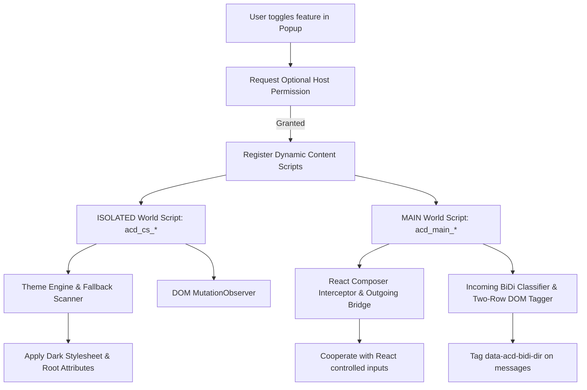

<a id="top"></a>
<div align="center">


# Adobe Connect Dark

### Advanced Dark Mode, Intelligent RTL Chat & Two-Row Layout for Adobe Connect Web

A source-driven Chromium extension (Manifest V3) that modernizes the Adobe Connect web interface while strictly preserving shared slides, PDFs, whiteboards, video streams, and screen sharing.

[](#v190)
[](#dynamic-runtime-registration)
[](#browser-compatibility)
[](#browser-compatibility)
[](#adobe-connect-compatibility)

<br>

<p align="center">
  
</p>

<br>

**Dark Reader Dynamic Theme · Theme Presets (Dark / AMOLED / Dim / Warm) · Chat Color Preservation · RTL Chat · Send RTL Formatting · Two-Row Chat · Media Protection**

</div>

<div align="center">

**English** | [فارسی](README.fa.md)

</div>

<div align="center">

<a href="#overview"><strong>Overview</strong></a> ·
<a href="#problems-this-extension-solves"><strong>Problems Solved</strong></a> ·
<a href="#features"><strong>Features</strong></a> ·
<a href="#feature-architecture"><strong>Architecture</strong></a> ·
<a href="#rtl-chat-text"><strong>RTL Chat</strong></a> ·
<a href="#installation"><strong>Install</strong></a> ·
<a href="#usage"><strong>Usage</strong></a> ·
<a href="#screenshots"><strong>Screenshots</strong></a> ·
<a href="#release-notes"><strong>Release Notes</strong></a>

</div>

---

## Quick Navigation

### Getting Started
- [Overview](#overview)
- [Problems This Extension Solves](#problems-this-extension-solves)
- [Screenshots](#screenshots)
- [Features Overview](#features)
- [Feature Architecture](#feature-architecture)
- [Core Features](#core-features)
  - [1. Dark Mode & Theme Presets](#1-dark-mode)
  - [2. Adobe Chat Color Preservation](#2-chat-colors)
  - [3. RTL Chat Text & Incoming BiDi](#3-rtl-chat-text)
  - [4. Send RTL Formatting](#4-send-rtl-formatting)
  - [5. Two-Row Chat Layout](#5-two-row-chat-layout)
- [Popup Controls & UI](#popup-controls)
- [Installation](#installation)
- [Usage Guide](#usage)

### Technical Architecture & Deep Dive
- [Per-Site Settings & Storage Model](#per-site-behavior)
- [Permission-on-Demand Model](#permission-on-demand)
- [Dynamic Runtime Registration](#dynamic-runtime-registration)
- [Open Shadow DOM Support](#shadow-dom-support)
- [Media & Content Preservation Architecture](#media-preservation)
- [Root State Attributes](#root-state-attributes)
- [Project Structure](#project-structure)
- [Adobe Connect Interface Coverage](#coverage)

### Compatibility & Governance
- [Browser Compatibility](#browser-compatibility)
- [Adobe Connect Compatibility](#adobe-connect-compatibility)
- [Privacy & Permissions](#privacy-security)
- [Known Limitations](#known-limitations)
- [Troubleshooting](#troubleshooting)
- [Developer Build & Contributing](#development)
- [Manual QA Checklist](#qa-checklist)
- [Release Notes (v1.9.0)](#release-notes)
- [License & Disclaimer](#license)
- [راهنمای سریع فارسی](#persian-guide)

---

<a id="overview"></a>

## Overview

Adobe Connect is widely used for live virtual classrooms, webinars, meetings, and recorded session playback. However, spending long hours in its default bright white interface can lead to severe eye fatigue—particularly when the user's operating system, browser, and neighboring applications are already dark.

**Adobe Connect Dark** provides a carefully engineered dark interface tailored to the HTML5 web client of Adobe Connect without interfering with shared meeting content.

Powered by a locally bundled, MV3-safe **Dark Reader** dynamic engine paired with selectable **Theme Presets** (`Dark`, `AMOLED`, `Dim`, `Warm`), Adobe-specific media protection rules, and semantic **Chat Color** preservation, the extension darkens pods, toolbars, menus, and dialogs while keeping shared slides, PDFs, whiteboards, video streams, and screen sharing intact.

In addition to visual theming, it provides an independent **RTL Chat Text** engine with intelligent bidirectional language classification for Persian, Arabic, and mixed-language chat, an optional **Send RTL Formatting** utility that embeds Unicode BiDi controls for other participants, and an independent **Two-Row Chat Layout** that places sender names and timestamps above message bodies.

---

<a id="problems-this-extension-solves"></a>

## Problems This Extension Solves

| Problem | Root Cause | Solution in Adobe Connect Dark |
| :--- | :--- | :--- |
| **Bright Adobe Connect interface** | Long class sessions, webinars, and meeting replays in a stark white UI cause visual fatigue and eye strain. | **Independent Dark Mode**: Applies deep, consistent dark palettes to pods, toolbars, sidebars, forms, and dialogs. |
| **Destroyed slides, PDFs, and video** | Naive dark mode extensions invert everything, rendering presentations, webcams, PDFs, and whiteboards illegible. | **Protected Content-Aware Theming**: Explicitly excludes shared stages, video streams, slides, PDFs, canvases, and content SVGs. |
| **Mixed Persian/English chat direction** | Typing mixed Persian and English text (e.g., technical terms or questions) results in flipped punctuation and reversed word order. | **Intelligent RTL Chat Text**: Accurately classifies direction, isolates inline math, handles English question markers, and adjusts alignment. |
| **Outgoing messages broken for other users** | When a user sends mixed RTL/LTR text, participants on default Adobe Connect clients often see inverted words and misplaced punctuation. | **Send RTL Formatting**: Optionally embeds standard Unicode BiDi formatting (`RLE`/`LRE`/`PDF`) into outgoing messages at send time. |
| **Visually crowded chat stream** | Adobe Connect places the sender name and message body on the same line, causing long Persian/Arabic names and messages to collide. | **Two-Row Chat Layout**: Automatically splits the chat item into Row 1 (Sender Name + Timestamp) and Row 2 (Message Body). |
| **Excessive extension permissions** | Many extensions require access to "all websites" at all times, raising privacy and compliance concerns. | **Permission-on-Demand Architecture**: Host permissions are requested strictly per-origin when you activate a feature for that specific site. |

---

<a id="screenshots"></a>

## Screenshots

### Popup Controls

<p align="center">
  
</p>

### Meeting Interface (Light vs. Dark Mode)

<p align="center">
  
  
</p>

### Chat Presentation Modes

<p align="center">
  
  
  
</p>

---

<a id="features"></a>

## Features Overview

| Feature | Type | Responsibility |
| :--- | :---: | :--- |
| **Dark Mode (Dark Reader Engine)** | Top-level | Dynamically themes Adobe Connect Central, live meeting rooms, recording playback, pods, sidebars, menus, and dialogs while protecting shared media. |
| **Theme Presets** | Sub-feature | Provides four selectable presets (`Dark`, `AMOLED`, `Dim`, `Warm`) with instant live switching and per-site persistence. |
| **Adobe Chat Color Preservation** | Core | Preserves visual distinction for Adobe Connect's native Chat Color choices (`Red`, `Orange`, `Green`, `Brown`, `Purple`, `Pink`, `Blue`, `Grey`, `Default`) in Dark Mode. |
| **RTL Chat Text & Incoming BiDi** | Top-level | Implements automatic bidirectional text classification (`data-acd-bidi-dir`), right alignment, and Vazirmatn typography for Persian, Arabic, and mixed-script chat. |
| **Send RTL Formatting** | Sub-feature | Optionally applies Unicode BiDi embedding controls to outgoing chat messages so other attendees view proper ordering. |
| **Two-Row Chat Layout** | Top-level | Places sender name and timestamp on the first row and the message body on the second row without modifying message text. |
| **Media & Share Protection** | Core | Avoids recoloring shared content such as webcam video, PDF/slides, screen sharing, and whiteboard canvases. |
| **Per-Site Settings** | Core | Stores preferences independently per `protocol://hostname` origin. |
| **Permission on Demand** | Core | Requests origin permissions only when a feature is activated for that specific site. |
| **Open Shadow DOM Styling** | Engine | Injects functional/chat stylesheets and attaches observers to accessible Open Shadow DOM roots across the page. |
| **Self-Healing Reconciliation** | Service Worker | Reconciles stored preferences, active permissions, and registered content scripts upon startup and updates. |

---

<a id="feature-architecture"></a>

## Feature Architecture

In v1.9.0, the visual dark theme pipeline and functional chat systems operate cleanly and independently:

```text
Adobe Connect Dark (v1.9.0)
│
├── Dark Mode (Top-level)
│   ├── Dark Reader Dynamic Engine (vendor/darkreader.js)
│   ├── Theme Presets (Dark · AMOLED · Dim · Warm)
│   ├── Adobe-Specific Dynamic Fixes & Media Protection
│   └── Semantic Chat Color Preservation (Red · Orange · Green · Brown · Purple · Pink · Blue · Grey · Default)
│
├── RTL Chat Text (Top-level, independent of Dark Mode)
│   ├── Incoming message BiDi direction classification (data-acd-bidi-dir)
│   ├── Live composer BiDi formatting & caret preservation
│   └── Send RTL Formatting (Sub-feature, active only when RTL Chat Text is ON)
│
└── Two-Row Chat Layout (Top-level, independent of Dark Mode & RTL Chat)
    └── Row 1: Sender + Timestamp | Row 2: Message Body
```

### Feature State Matrix

Because Dark Mode, RTL Chat Text, and Two-Row Chat Layout are decoupled, you can enable any combination that fits your workflow:

| Dark Mode | RTL Chat Text | Send RTL Formatting | Two-Row Layout | Effective Result |
| :---: | :---: | :---: | :---: | :--- |
| **Off** | **Off** | Inactive | **Off** | Native Adobe Connect appearance and default single-line chat. |
| **Off** | **Off** | Inactive | **On** | Native Adobe Connect appearance with two-row chat layout. |
| **On** | **Off** | Inactive | **Off** | Selected Dark Mode preset across all pods with default native chat layout. |
| **Off** | **On** | Off | **Off** | Native light appearance + local RTL chat display (outgoing text stays clean). |
| **Off** | **On** | On | **Off** | Native light appearance + local RTL chat + outgoing RTL formatting for other participants. |
| **Off** | **On** | On | **On** | Native light appearance + RTL chat + outgoing formatting + two-row layout. |
| **On** | **On** | Off | **On** | Selected Dark Mode preset + local RTL chat + two-row layout (outgoing text stays clean). |
| **On** | **On** | On | **On** | Selected Dark Mode preset + RTL chat + outgoing formatting + two-row layout. |

> [!NOTE]
> The extension status badge in the popup indicates **Active** whenever **Dark Mode**, **RTL Chat Text**, or **Two-Row Chat Layout** is enabled.

---

<a id="core-features"></a>

## Core Features

<a id="1-dark-mode"></a>

### 1. Dark Mode & Theme Presets

Dark Mode is an independent top-level feature powered by a locally bundled, MV3-compliant **Dark Reader** dynamic theme engine (`vendor/darkreader.js`) tailored with Adobe Connect rules (`content/darkreader-engine.js`) and a central preset registry (`content/darkreader-presets.js`).

#### Theme Presets

- **`Dark` (Default)** — Balanced default dark theme designed for everyday virtual classrooms and meetings.
- **`AMOLED`** — Deep black / OLED-friendly appearance with true black primary surfaces.
- **`Dim`** — Softer, lower-intensity dark theme with slate-charcoal surfaces for reduced contrast during long sessions.
- **`Warm`** — Subtle warmer night theme with a comfortable warm surface tone.

#### Dark Mode Behavior

- **Dark Mode OFF**: Adobe Connect retains its native light appearance. Changing the preset while Dark Mode is OFF saves your choice for the next time Dark Mode is enabled without turning Dark Mode on.
- **Dark Mode ON**: The selected preset (`Dark`, `AMOLED`, `Dim`, or `Warm`) is applied immediately. Switching presets updates the live Adobe Connect page in-place without reloading the tab or disrupting active audio/video streams.

---

<a id="2-chat-colors"></a>

### 2. Adobe Chat Color Preservation

In Adobe Connect, participants can choose a custom personal **Chat Color** for their messages. Standard dark themes either flatten all chat bubbles into a single grey box or leave default bubbles bright white.

Adobe Connect Dark classifies each chat bubble semantically (`[data-acd-chat-color]`) and maps it to a dark-compatible palette (`styles/chat-colors.css`) so Adobe native Chat Color choices remain visually distinct across all Dark Mode presets while keeping message text crisp and readable.

**Supported semantic color families:**
- `Red`
- `Orange`
- `Green`
- `Brown`
- `Purple`
- `Pink`
- `Blue`
- `Grey`
- `Default` (standard uncolored messages render as a neutral dark bubble)

When Dark Mode is turned OFF, all chat bubbles immediately revert to Adobe Connect's native light appearance.

---

<a id="3-rtl-chat-text"></a>

### 3. RTL Chat Text & Incoming BiDi

RTL Chat Text (`#rtl-toggle`) provides right-to-left layout, Vazirmatn typography, and automatic bidirectional (BiDi) text classification for Persian, Arabic, and mixed-script chat messages.

- **Scoped to Chat Content**: Adjusts chat message flow and typing alignment without mirroring pod headers, tabs, buttons, or scrollbars.
- **Automatic BiDi Classification**: Incoming messages and composer lines are evaluated per line (`classifyLineDirection`) using strong directional characters, lexical English sentence-starter awareness, and inline math isolation (`22 - 2`, `۲۲ - ۲ = ۲۰`) rather than naive first/last-character rules:
  - `سلام خوبی؟` → **RTL** (Persian sentence; right-aligned with natural punctuation placement).
  - `linux چیه ؟` → **RTL** (technical Latin term introducing a Persian question; classified as RTL so the sentence and question mark read naturally from right to left).
  - `سلام alireza چطوری؟` → **RTL** (mixed Persian/English sentence; classified as RTL while keeping the Latin token ordered properly inline).
  - `hello world` → **LTR** (English sentence; classified as LTR and left-aligned).
- **Non-Destructive Incoming Rendering**: Incoming message DOM nodes are tagged with `data-acd-bidi-dir="rtl"` or `data-acd-bidi-dir="ltr"` without modifying the received `textContent`.
- **Live Composer Support**: Formats text inside the chat input box (`#chatTypingArea`) as you type while preserving cursor/selection positions and cooperating with Adobe Connect's React input state.

---

<a id="4-send-rtl-formatting"></a>

### 4. Send RTL Formatting

Send RTL Formatting (`#send-rtl-toggle`) is an optional sub-feature under RTL Chat Text that helps other meeting participants (who may not have the extension installed) see mixed Persian/English messages in the proper order.

- **RTL Chat ON + Send RTL ON**: Outgoing RTL formatting is applied when you send a message (using standard Unicode BiDi embedding controls and Persian question mark normalization on RTL lines).
- **RTL Chat ON + Send RTL OFF**: Local RTL layout and incoming BiDi detection remain active in your browser, while outgoing text stays clean and unformatted when sent.
- **RTL Chat OFF**: Send RTL Formatting is effectively inactive and disabled in the popup.

---

<a id="5-two-row-chat-layout"></a>

### 5. Two-Row Chat Layout

Two-Row Chat Layout (`#chat-two-row-toggle`) restructures each chat message container using CSS Grid for cleaner readability in busy rooms:

- **First Row**: Sender name and message timestamp.
- **Second Row**: Message body spanning the full width below the header row.

```text
User                                                 10:45 AM
سلام alireza چطوری؟
```

Two-Row Chat works **independently from Dark Mode** (and independently from RTL Chat) and **never modifies message text content**.

---

<a id="popup-controls"></a>

## Popup Controls & UI

The extension popup provides clear, per-site controls with real-time state feedback:

| UI Control | Element ID | Function |
| :--- | :--- | :--- |
| **Current Domain** | `#current-domain` | Displays the detected origin protocol and host (e.g., `connect.example.com (HTTPS)`). |
| **Status Badge** | `#status-badge` | Indicates `Active` (blue) if any top-level feature is enabled, or `Inactive` (gray). |
| **Dark Mode Toggle** | `#theme-toggle` | Toggles Dark Mode for the current site. |
| **Theme Selector** | `#theme-preset-select` | Selects the per-site theme preset (`Dark`, `AMOLED`, `Dim`, `Warm`) with instant live switching. |
| **RTL Chat Text Toggle** | `#rtl-toggle` | Toggles right-to-left chat handling for the current site. |
| **Send RTL Formatting** | `#send-rtl-toggle` | Nested sub-toggle; controls whether outgoing messages include RTL formatting. Disabled when RTL Chat is off. |
| **Two-Row Chat Layout** | `#chat-two-row-toggle` | Toggles the two-row sender/message layout for the current site. |
| **Reset Site Button** | `#reset-btn` | Clears stored settings for the origin (resetting `themePreset` to `dark`), unregisters content scripts, and revokes host permission. |
| **Protected Content Note** | `.safety-badge` | Displays safety notice: *"Webcam, screen share & slides protected"*. |
| **Version Indicator** | `#extension-version` | Automatically displays the version read from `manifest.json` (`v1.9.0`). |

---

<a id="installation"></a>

## Installation

Adobe Connect Dark is distributed as an unpacked Manifest V3 browser extension for Chromium-based browsers (**Google Chrome**, **Microsoft Edge**, **Brave**, **Opera**).

### Installation Steps (For Users)

1. **Download the release ZIP** from GitHub (or clone this repository).
2. **Extract** the ZIP archive to a local folder on your computer.
3. Open `chrome://extensions` (or `edge://extensions` in Microsoft Edge).
4. Enable **Developer mode**.
5. Click **Load unpacked**.
6. Select the extracted extension folder (the folder containing `manifest.json`).

> [!NOTE]
> **No Node.js or npm is required for users.** `vendor/darkreader.js` is pre-built and committed in the repository and release archive so the extension works immediately when loaded unpacked.

---

<a id="usage"></a>

## Usage Guide

1. **Navigate to Adobe Connect**:
   - Open your organization's Adobe Connect room, webinar, or recording URL (e.g., `https://connect.example.com/room-name`).
2. **Open the Popup**:
   - Click the **Adobe Connect Dark** icon in the browser toolbar.
3. **Enable Desired Features**:
   - Switch on **Dark Mode** to darken the application UI, and choose your preferred **Theme** (`Dark`, `AMOLED`, `Dim`, or `Warm`).
   - Switch on **RTL Chat Text** to enable right-to-left Persian/Arabic chat text.
   - *(Optional)* Adjust **Send RTL Formatting** if you want outgoing messages formatted for other participants.
   - Switch on **Two-Row Chat Layout** if you prefer sender names stacked above messages.
4. **Grant Origin Permission**:
   - On first activation for a new domain, your browser will prompt you to allow access to that specific origin. Click **Allow**.
5. **Persistent Storage**:
   - Your preferences are automatically saved for that origin. When you revisit the room, your settings are applied immediately at `document_start`.
6. **Resetting a Site**:
   - Click **Reset Site / بازنشانی دامنه** in the popup to return the site to default native behavior (`themePreset` → `dark`) and revoke origin permissions.

---

<a id="per-site-behavior"></a>

## Per-Site Settings & Storage Model

All configuration is strictly scoped to the site's origin (`protocol + hostname`). Separate records are maintained for HTTP and HTTPS variants.

### Storage Keys

The extension uses `chrome.storage.local` with the following schema:

| Storage Key | Value Type | Purpose | Scope |
| :--- | :--- | :--- | :--- |
| `acd_enabled_sites` | `Record<string, boolean>` | Stores per-site Dark Mode state (`true` = active). | Origin key (e.g., `https://connect.example.com`) |
| `acd_theme_preset_sites` | `Record<string, string>` | Stores per-site Dark Reader theme preset (`"dark"`, `"amoled"`, `"dim"`, `"warm"`). Invalid or missing values safely fall back to `"dark"`. | Origin key (defaults to `"dark"`) |
| `acd_rtl_chat_sites` | `Record<string, boolean>` | Stores per-site RTL Chat Text state (`true` = active). | Origin key |
| `acd_send_rtl_formatting_sites` | `Record<string, boolean>` | Stores per-site outgoing Send RTL Formatting preference (`true`/`false`). | Origin key (defaults to `true` when RTL Chat is enabled) |
| `acd_chat_two_row_sites` | `Record<string, boolean>` | Stores per-site Two-Row Chat Layout state (`true` = active). | Origin key |
| `acd_enabled_domains` | `Record<string, boolean>` | *Legacy key*. Automatically migrated to `acd_enabled_sites` on startup. | Legacy hostname key |

### Example Stored State

```json
{
  "acd_enabled_sites": {
    "https://connect.example.com": true
  },
  "acd_theme_preset_sites": {
    "https://connect.example.com": "amoled"
  },
  "acd_rtl_chat_sites": {
    "https://connect.example.com": true
  },
  "acd_send_rtl_formatting_sites": {
    "https://connect.example.com": true
  },
  "acd_chat_two_row_sites": {
    "https://connect.example.com": true
  }
}
```

---

<a id="permission-on-demand"></a>

## Permission-on-Demand Model

To ensure optimal privacy, security, and performance, Adobe Connect Dark adheres to a strict permission-on-demand model:

### Declared Manifest Permissions
- `storage`: Required to persist user preferences in `chrome.storage.local`.
- `activeTab`: Grants temporary access to the active tab when the popup is opened.
- `scripting`: Required to register dynamic content scripts for enabled sites.

### Optional Host Permissions
```json
"optional_host_permissions": [
  "http://*/*",
  "https://*/*"
]
```

### How Permissions Are Managed
- The extension does **not** possess blanket access to all websites upon installation.
- When you enable a feature for a domain, the extension invokes `chrome.permissions.request({ origins: ["https://domain.com/*"] })`.
- If the permission is granted, the dynamic content script is registered.
- Dynamic script registration is maintained only as long as at least one top-level feature remains enabled:
  ```javascript
  const siteNeedsExtension = isDarkEnabled || isRtlEnabled || isTwoRowEnabled;
  ```
- If all features are turned off or if **Reset Site** is clicked, the registration is removed, and `chrome.permissions.remove` revokes origin host access.

---

<a id="dynamic-runtime-registration"></a>

## Dynamic Runtime Registration

To eliminate white flashes and interact seamlessly with Adobe Connect's single-page React client, scripts are registered dynamically rather than statically declared across all pages:



### Execution Worlds

1. **ISOLATED World** (`acd_cs_<protocol>_<host>`):
   - **Files**: `vendor/darkreader.js`, `content/darkreader-presets.js`, `content/darkreader-engine.js`, `content/theme-engine.js`, `content/observer.js`, `content/content.js`
   - **Configuration**: `runAt: "document_start"`, `allFrames: true`, `world: "ISOLATED"`
   - **Responsibilities**:
     - Synchronizes storage settings with `documentElement`.
     - Applies Dark Reader dynamic theme with the selected preset (`dark`, `amoled`, `dim`, `warm`) and shared Adobe Connect protection fixes.
     - Injects functional stylesheets (`styles/chat-functional.css`, `styles/chat-colors.css`).
     - Inspects and styles accessible Open Shadow DOM roots.
2. **MAIN World** (`acd_main_<protocol>_<host>`):
   - **Files**: `content/chat-rtl-main.js`
   - **Configuration**: `runAt: "document_start"`, `allFrames: true`, `world: "MAIN"`
   - **Responsibilities**:
     - Executes in the page's execution context to cooperate directly with Adobe Connect's React state.
     - Intercepts Chat typing and Send events without triggering input desynchronization.
     - Intercepts `Element.prototype.attachShadow` to capture dynamically mounted open shadow trees.
     - Performs line classification and tags incoming chat message elements.

### Self-Healing Synchronization
On browser startup (`runtime.onStartup`) and extension installation/update (`runtime.onInstalled`), the background service worker executes `syncRegisteredScripts()`:
- Verifies stored active sites against actual granted permissions via `chrome.permissions.contains`.
- Purges stale records if host access was revoked externally.
- Automatically re-registers content scripts if permissions exist but registration was cleared by the browser.

---

<a id="shadow-dom-support"></a>

## Open Shadow DOM Support

Adobe Connect Web components frequently employ Shadow DOM encapsulation for pod controls, menus, and custom elements.

- **Open Shadow Roots**:
  - The extension hooks `Element.prototype.attachShadow` in the MAIN world to discover newly created open shadow roots.
  - In the ISOLATED world, `themeEngine.scanForShadowRoots()` traverses the DOM tree to locate existing shadow roots.
  - Dedicated stylesheets (`styles/shadow-dom.css`) and layout styles are injected directly into each open root.
  - A lightweight `MutationObserver` is attached to each shadow root to process dynamically added shadow elements.
- **Closed Shadow Roots Limitation**:
  - Web platform security prevents browser extensions from traversing or styling closed shadow roots (`mode: "closed"`). Elements encapsulated within closed shadow roots cannot be directly restyled.

---

<a id="media-preservation"></a>

## Media & Content Preservation Architecture

The foundational rule of Adobe Connect Dark is:

> **Theme the application shell, never the user's shared presentation content.**

Shared slides, PDF documents, whiteboards, video feeds, and screen shares may **intentionally remain light** when their original material is light, ensuring diagrams, slides, and camera feeds are never inverted or distorted.

### Protected Elements & Containers

The following elements and selector patterns are explicitly excluded from recoloring or image inversion:

- **Webcam & Video Streams**: `video`, `.video-stream-element`, `[class*="streamPlayerLoaderScreen--"]`
- **Presentation Slides**: `.presentation-content`, `.slide-container`, `[data-ac-role="presentation"]`, `[class^="pptLoaderScreen--"]`
- **PDF Viewer & Renderers**: `#pdf-viewer`, `.canvasHTMLPDF`, `.canvasSingleHTMLPDF`, `[class^="pdfLoaderScreen--"]`
- **Screen Sharing Surfaces**: `[class^="screenShareLoader--"]`, `[data-ac-role="screenshare"]`
- **Whiteboard & Canvas**: `canvas`, `.whiteboard-canvas`, `[class*="whiteboardWrapper--"]`, `[class*="wbShapesWrapper--"]`
- **Shared Stage Containers**: `[class^="shareContent--"]`, `[class*=" shareContent--"]`, `img`, `picture`
- **Preserved Containers**: Elements tagged with `[data-acd-preserve="true"]` or `.acd-preserve`

### SVG Differentiation

- **Content SVGs**: SVGs inside slide containers, presentation viewports, or whiteboard canvases are treated as shared content and preserved with `filter: none !important; mix-blend-mode: normal !important;`.
- **UI SVGs**: Toolbar icons, pod menu glyphs, and button icons follow the active dark theme while preserving semantic audio/microphone status colors (`#33ab84` active green and `#ec5b62` muted red).

---

<a id="root-state-attributes"></a>

## Root State Attributes

The extension communicates runtime state using attributes on the `<html>` (`documentElement`) element and individual message wrappers:

| Attribute | Location | Possible Values | Meaning |
| :--- | :--- | :--- | :--- |
| `data-acd-theme-preset` | `<html>` | `"dark"`, `"amoled"`, `"dim"`, `"warm"` | Active Dark Reader theme preset when Dark Mode is enabled. |
| `data-acd-chat-rtl` | `<html>` | `"true"` | RTL Chat Text is active for this site. |
| `data-acd-send-rtl-formatting` | `<html>` | `"true"`, `"false"` | Outgoing Send RTL Formatting state (effective when RTL Chat is on). |
| `data-acd-chat-two-row` | `<html>` | `"true"` | Two-Row Chat Layout is active for this site. |
| `data-acd-chat-color` | Chat Message Bubble | `"default"`, `"red"`, `"orange"`, `"green"`, `"brown"`, `"purple"`, `"pink"`, `"blue"`, `"grey"` | Semantic Adobe Chat Color identity preserved across all Dark Mode presets. |
| `data-acd-bidi-dir` | Chat Message Body | `"rtl"`, `"ltr"` | Dynamically applied direction computed by the BiDi classifier. |
| `data-acd-chat-two-line` | Message Wrapper | `"true"` | Marks message container for two-row grid styling. |
| `data-acd-preserve` | Any Container | `"true"` | Explicitly exempts element and its subtree from theming. |
| `data-acd-theme` | `<html>` | `"dark"` | Present only when the isolated legacy visual fallback mode (`darkEngine === 'legacy'`) is used. |

---

<a id="project-structure"></a>

## Project Structure

```text
adobe-connect-dark/
├── manifest.json                 # Manifest V3 metadata, permissions & resource declarations
├── background.js                 # Service worker: self-healing script sync & badge management
├── vendor/
│   └── darkreader.js             # Committed MV3-safe Dark Reader v4.9.133 runtime bundle
├── content/
│   ├── darkreader-presets.js     # Central registry of Dark Reader theme presets (Dark, AMOLED, Dim, Warm)
│   ├── darkreader-engine.js      # Dark Reader adapter & shared Adobe Connect dynamic fixes
│   ├── content.js                # Content script entry point & storage-to-DOM synchronizer
│   ├── observer.js               # Debounced MutationObserver for SPA DOM additions
│   ├── theme-engine.js           # Theme lifecycle, Chat Color classifier & Shadow DOM manager
│   └── chat-rtl-main.js          # MAIN-world bridge: React composer interceptor & BiDi engine
├── popup/
│   ├── popup.html                # Extension popup markup (including Theme Preset selector)
│   ├── popup.css                 # Popup user interface styling
│   └── popup.js                  # Popup controls, permission requester & storage controller
├── styles/
│   ├── chat-functional.css       # Independent RTL Chat, Vazirmatn @font-face & Two-Row Chat rules
│   ├── chat-colors.css           # Semantic dark-palette overrides for Adobe Chat Colors
│   ├── shadow-dom.css            # Encapsulation-safe rules for Open Shadow DOM roots
│   └── ...                       # Isolated legacy fallback stylesheets
├── scripts/
│   ├── build-darkreader.mjs      # Reproducible generator for vendor/darkreader.js
│   └── verify-darkreader.mjs     # Automated MV3 CSP & byte-for-byte reproducibility verifier
├── assets/
│   └── fonts/
│       ├── OFL.txt               # Open Font License for Vazirmatn
│       └── Vazirmatn-Regular.woff2# Bundled local Persian/Arabic font
├── icons/
│   ├── icon16.png                # Toolbar icon (16x16)
│   ├── icon32.png                # Toolbar icon (32x32)
│   ├── icon48.png                # Extensions management icon (48x48)
│   └── icon128.png               # Display icon (128x128)
├── BUILDING.md                   # Developer build & verification guide for vendor/darkreader.js
├── README.md                     # Project documentation (English)
└── README.fa.md                  # Project documentation (Persian)
```

---

<a id="coverage"></a>

## Adobe Connect Interface Coverage

The extension provides comprehensive component coverage across the web application:

### Adobe Connect Central
- **Navigation**: Top header bar, primary navigation tabs, breadcrumbs, and user menu.
- **Search & Filter**: Global search fields, dropdown filters, and result lists.
- **Calendar**: Week view, Month view, Activity view, day headers, day badges, and event popovers.
- **Reports & Administration**: Reporting cards, summary tables, participant logs, and download dialogs.
- **Forms & Dialogs**: Spectrum dialog overlays, modal windows, textboxes, dropdowns, and checkboxes.

### Live Meeting & Recording Playback
- **Pod Shells**: Pod titles, headers, borders, pod menus, and minimize/maximize buttons.
- **Chat Pod**: Message list, semantic Chat Color bubbles, sender names, timestamps, message content, compose textarea, and send button.
- **Attendees Pod**: Hosts, Presenters, and Participants accordion sections, user rows, status icons, and search filter.
- **Video Pod**: Video chrome, speaker label overlays, multi-camera grid frames, and empty state placeholders.
- **Share Pod Chrome**: Surrounding control bar, layout switcher, zoom controls, and page navigation (inner shared content preserved).
- **Recording Player**: Timeline scrubber, play/pause controls, progress rail, elapsed/total time, volume slider, and event index sidebar.
- **Other Pods**: Notes Pod, Polls Pod (questions/answers), Files Pod, and Web Links Pod chrome.

---

<a id="browser-compatibility"></a>

## Browser Compatibility

| Browser | Support Level | Engine | Notes |
| :--- | :---: | :--- | :--- |
| **Google Chrome** | Supported | Chromium (V8 / Blink) | Primary development and validation target. |
| **Microsoft Edge** | Supported | Chromium (V8 / Blink) | Compatible Manifest V3 behavior. |
| **Brave** | Supported | Chromium (V8 / Blink) | Compatible Chromium Manifest V3 extension. |
| **Opera / Opera GX** | Supported | Chromium (V8 / Blink) | Supported via Chromium extensions management. |
| **Mozilla Firefox** | Not Targeted | Gecko / SpiderMonkey | Manifest V3 background script differences not implemented. |
| **Apple Safari** | Not Targeted | WebKit | Requires separate WebExtension packaging. |

---

<a id="adobe-connect-compatibility"></a>

## Adobe Connect Compatibility

- **Target Interface**: Adobe Connect HTML5 Web Client and Recording UI.
- **Resilient Selectors**: The extension avoids hardcoded CSS-module hash suffixes (e.g., `chatMessageSender--abc123xyz`), relying instead on resilient prefix selectors (`[class^="chatMessageSender--"]`) and semantic container hierarchies.

---

<a id="privacy-security"></a>

## Privacy & Permissions

Adobe Connect Dark operates locally in your browser and requests only the permissions required for its features:

- **`storage`**: Saves your per-site toggle states and selected theme preset in `chrome.storage.local`.
- **`activeTab`**: Detects the current tab's origin (`protocol://hostname`) when you open the extension popup.
- **`scripting`**: Dynamically registers and unregisters the extension's content scripts for origins you explicitly enable.
- **`optional_host_permissions` (`http://*/*`, `https://*/*`)**: Requested on demand per origin (`https://your-adobe-server.example/*`) only when you turn on a feature for that site, and revoked automatically when you turn all features off or click **Reset Site**.
- **Local Execution**: All scripts, stylesheets, Dark Reader runtime (`vendor/darkreader.js`), and fonts (`Vazirmatn`) are bundled inside the extension package. The extension does not include analytics, tracking scripts, or external telemetry endpoints.

---

<a id="known-limitations"></a>

## Known Limitations

- **Chromium Target**: Built and tested as a Chromium Manifest V3 extension; Firefox and Safari are not currently targeted.
- **Closed Shadow DOM**: Elements encapsulated inside closed shadow roots (`mode: "closed"`) cannot be traversed or styled by browser extensions due to browser security boundaries.
- **Future Adobe Connect DOM Updates**: If Adobe makes structural changes to HTML5 client class prefixes or pod DOM hierarchies, selectors may require updates.
- **Complex Multilingual Edge Cases**: Unusual multilingual sentences mixing three or more scripts on a single line may rely on browser default BiDi resolution.

---

<a id="troubleshooting"></a>

## Troubleshooting

### Dark Mode does not appear after enabling
1. Verify that the popup status badge indicates **Active**.
2. Ensure you clicked **Allow** on the browser's permission prompt for the domain.
3. Refresh the Adobe Connect page (`F5` or `Ctrl+R`).
4. Inspect the page HTML in DevTools: verify that `<html data-acd-theme-preset="dark">` (or your chosen preset) is present.

### RTL Chat is enabled but the Chat Pod layout did not mirror
- This is expected and intentional. The extension adjusts text direction, message flow, and typing alignment without mirroring pod headers, tabs, or buttons.

### Shared slides or PDF documents remain light
- This is intentional. The extension protects shared lesson content, presentations, PDFs, whiteboard drawings, and video streams from recoloring so original materials remain accurate.

### Two-Row Chat Layout is not displaying on two lines
1. Confirm that **Two-Row Chat Layout** is toggled ON in the popup.
2. Verify that `<html data-acd-chat-two-row="true">` is present on the root element.

### Outgoing messages look correct locally but unformatted for other participants
- Ensure the nested sub-toggle **Send RTL Formatting** is enabled in the popup. When disabled, outgoing text is sent as raw plain text.

---

<a id="development"></a>

## Developer Build & Contributing

`vendor/darkreader.js` is intentionally committed to the repository so end users never need Node.js or `npm`.

Developers who wish to rebuild and verify the MV3-safe Dark Reader bundle from `darkreader@4.9.133` can run:

```bash
npm ci
npm run build:darkreader
npm run verify:darkreader
```

See [BUILDING.md](BUILDING.md) for details on the reproducible build pipeline and MV3 CSP verification checks.

### Local Development Loop

1. Edit the repository locally.
2. Open `chrome://extensions` and click the **Reload** icon on the Adobe Connect Dark card.
3. Refresh your Adobe Connect tab and inspect DOM state in DevTools (`F12`):
   ```javascript
   document.documentElement.getAttribute('data-acd-theme-preset'); // "dark" | "amoled" | "dim" | "warm"
   document.documentElement.getAttribute('data-acd-chat-rtl');     // "true"
   document.documentElement.getAttribute('data-acd-chat-two-row'); // "true"
   ```

---

<a id="qa-checklist"></a>

## Manual QA Checklist

Before releasing updates, verify the following checklist:

### Feature & Preset Combinations
- [ ] Dark Mode OFF, RTL OFF, Two-Row OFF (native appearance)
- [ ] Dark Mode ON with `Dark`, `AMOLED`, `Dim`, and `Warm` presets (instant live switching)
- [ ] Dark Mode OFF, RTL ON, Two-Row OFF
- [ ] Dark Mode OFF, RTL ON, Two-Row ON
- [ ] Dark Mode ON, RTL ON, Two-Row ON
- [ ] Reset Site cleans up storage (`themePreset` → `dark`), removes script registrations, and revokes host permissions

### Chat Pod & Chat Color Verification
- [ ] Adobe Chat Color bubbles (`Red`, `Orange`, `Green`, `Brown`, `Purple`, `Pink`, `Blue`, `Grey`, `Default`) remain visually distinct in Dark Mode
- [ ] Pure Persian message: `سلام خوبی؟` (RTL, right-aligned)
- [ ] Latin-led mixed sentence: `linux چیه ؟` (classified RTL)
- [ ] Mixed Persian/English sentence: `سلام alireza چطوری؟` (classified RTL)
- [ ] Pure English message: `hello world` (LTR, left-aligned)
- [ ] Two-Row layout displays sender name + time on row 1, message body on row 2

### Content Preservation Verification
- [ ] Shared PowerPoint / PDF slide colors remain intact
- [ ] Webcam video stream colors remain normal
- [ ] Screen sharing area is uncolored
- [ ] Whiteboard drawings and canvas elements remain intact

---

<a id="release-notes"></a>

## Release Notes

<a id="v190"></a>

### v1.9.0 — Dark Reader Dynamic Engine & Theme Presets

- **Dark Reader Dynamic Theme Engine (`darkreader@4.9.133`)**: Adopted the official Dark Reader dynamic engine (`vendor/darkreader.js`, `content/darkreader-engine.js`) as the primary Dark Mode visual engine, paired with Adobe Connect dynamic fixes and media preservation rules.
- **Selectable Per-Site Theme Presets (`Dark`, `AMOLED`, `Dim`, `Warm`)**: Added a central preset registry (`content/darkreader-presets.js`), popup **Theme** selector (`#theme-preset-select`), and per-site storage (`acd_theme_preset_sites`) with instant live switching without page reload.
- **Dedicated Semantic Chat Color Preservation (`styles/chat-colors.css`)**: Extracted and preserved semantic Adobe Connect Chat Color mapping (`[data-acd-chat-color="default | red | orange | green | brown | purple | pink | blue | grey"]`) so user-selected Chat Colors remain visually distinct across all four Dark Mode presets.
- **Clean Functional & Visual Separation (`styles/chat-functional.css`)**: Isolated RTL Chat, Incoming BiDi classification (`data-acd-bidi-dir`), Send RTL Formatting, Two-Row Chat Layout (`data-acd-chat-two-row`), and bundled `Vazirmatn` font rules into a dedicated functional stylesheet completely independent of the visual dark engine.
- **MV3 CSP Fix & Reproducible Vendor Bundle Pipeline**: Replaced Dark Reader's page-world `<script>` proxy injection with an MV3-compliant no-op (`scripts/build-darkreader.mjs`) and added automated verification (`scripts/verify-darkreader.mjs`) to guarantee zero CSP violations and byte-for-byte reproducibility.

---

### v1.8.5 — Modal Visual Polish

- **Restored True Modal Separation & Underlay Dimming**: Separated the full-screen modal overlay/underlay (`#confirmationDialog`, `#notificationDialog`, `.spectrumModalDialog--...`, `.spectrum-Underlay`) from the dialog card root, applying a darker translucent backdrop (`--acd-backdrop-modal: rgba(0, 0, 0, 0.56)`) with zero border or shadow so the background workspace visually recedes.
- **Single Elevated Modal Card Surface**: Styled only the true modal root (`#confirmationDialog .spectrum-Dialog`, `.spectrum-Dialog.react-spectrum-Dialog`, `#openPOAFromPodsMenuDialog`) with `--acd-bg-elevated` (`#222A34`), `1px solid var(--acd-border)`, `8px` border radius, and a deep elevated shadow (`--acd-shadow-modal`) so the modal stands out above `--acd-bg-main` and `--acd-bg-panel`.
- **Removed "Textarea Look" from Modal Description**: Removed `[class*="promotionDialog--"]` from the card-surface selector group, eliminating the inner rectangular border, background, radius, and shadow around the `"If you have the Adobe Connect application installed..."` description block.
- **Clean Header, Body & Footer Hierarchy and Spacing**: Hid the duplicate native `.spectrum-Dialog-header::after` divider, removed redundant footer borders, balanced vertical spacing across header (`12px` padding / `14px` margin), body (`1.55` line-height), and footer (`22px` top spacing), and refined Primary CTA (`Launch Adobe Connect`) and Secondary (`Cancel`, `Download Adobe Connect`) buttons without pill distortion or double `::after` borders.

---

<a id="v184"></a>

### v1.8.4 — Dark Chat Color Mapping Fix

- **Fixed Light/Default Adobe Chat Bubbles Leaking into Dark Mode**: Resolved the v1.8.3 regression where normal/default Adobe Connect chat messages (which also carry inline `background` styles such as `rgb(245, 245, 245)` or `#ffffff`) were treated as custom Chat Colors and rendered as bright white/light-grey cards inside Dark Mode.
- **Replaced Broad Inline-Background Detection with Semantic Chat Color Mapping**: Removed the `[style*="background"]` assumption and introduced an isolated, non-destructive semantic classifier (`classifyChatBubbleColor`) that maps native inline bubble RGB values to `data-acd-chat-color="default | red | orange | green | brown | purple | pink | blue | grey"`.
- **Added Dark-Compatible Variants for Adobe Chat Colors**: Designed subtle, non-fluorescent dark-tinted bubble surfaces (`--acd-chat-bubble-red`, `orange`, `green`, `brown`, `purple`, `pink`, `blue`, `grey`), hue-aware light sender accents, subtle borders, and crisp light primary text (`#F0F3F6`) so selected Chat Colors remain visually distinguishable without breaking Dark Mode aesthetics.
- **Preserved RTL, Two-Row & Native Chat State**: Maintained 100% independence of RTL/LTR line classification (`data-acd-bidi-dir`), Send RTL Formatting, Two-Row layout (`data-acd-chat-two-row`), self-message alignment (`margin-left: auto`), and full native appearance restoration when Dark Mode is turned off.

---

<a id="v183"></a>

### v1.8.3 — Chat Color & Bubble Fix

- **User-Selected Chat Color Bubble Preservation**: Fixed the root cause where Adobe Connect applies user-selected Chat Colors (`Green`, `Red`, `Blue`, `Grey`, etc.) as an inline `background` / `background-color` directly on `chatIndividualMessageContentWrapperDiv` (e.g., `style="background: rgb(215, 235, 218); ..."`). Default dark bubble backgrounds (`var(--acd-chat-bubble-default)`) are now strictly scoped with `:not([style*="background" i])` so Adobe's inline colored bubble backgrounds win unconditionally.
- **High-Contrast Typography on Pastel Colored Bubbles**: Added dedicated high-contrast dark foreground tokens (`--acd-chat-colored-sender: #1F242B`, `--acd-chat-colored-text: #2C2C2C`, `--acd-chat-colored-time: #4B4B4B`) for sender names, message bodies, timestamps, and links when rendered inside a user-colored pastel chat bubble, preventing low-contrast white-on-pastel text while keeping default dark bubbles styled with light foregrounds.
- **Non-Destructive Inline Style & Layout Coexistence**: Preserved all native inline layout declarations (`padding`, `margin-left: auto`) on `chatIndividualMessageContentWrapperDiv` alongside `data-acd-chat-two-line="true"`, RTL/LTR line classification (`data-acd-bidi-dir`), and Send RTL Formatting in both Normal DOM and Open Shadow DOM.

---

<a id="v182"></a>

### v1.8.2

- **Spectrum Substring Selector Refactoring**: Replaced broad substring selectors (`[class*="spectrum-Dialog"]`, `[class*="spectrum-Toast"]`, `[class*="spectrum-Popover"]`, `[class*="spectrum-Menu"]`, `[class*="spectrum-Picker"]`, `[class*="spectrum-Dropdown"]`) across all stylesheets with exact token and root component selectors (`.spectrum-Dialog, [class~="spectrum-Dialog"], [class^="spectrum-Dialog--"]`). Child elements (`header`, `content`, `footer`, `typeIcon`) are now styled strictly as layout/typography containers rather than independent nested cards.
- **Normal DOM & Shadow DOM Menu Parity**: Unified Open Shadow DOM menus with Normal DOM hierarchy. The Popover container now functions as the single unified card surface (`--acd-bg-elevated`, subtle border, 6px radius, soft shadow), while inner menus are fully flat and transparent with subtle hover/selection highlights and thin dividers.
- **Preserved Chat Colors & Swatches**: Prevented Layer 1 dynamic luminance detection (`data-acd-text="dark"`, `data-acd-surface="bright"`) from touching chat messages, message wrappers, or color palette swatches. User-selected chat text colors (Red, Green, Blue, Grey) and color dots in the palette now strictly preserve their native inline styles while coexisting smoothly with RTL/LTR classification and Two-Row layout.
- **Dialog & Toast Root-vs-Child Architecture**: Cleanly separated root elevation from child elements in all Dialogs (Connection Status, Switch to Application, Alerts, Manage Pods) and Toasts. Header and footer elements render with clean divider borders only, while body content remains transparent without nested borders or conflicting box shadows.
- **Single Chat Tab Active Indicator**: Solved duplicate underlines on active chat tabs by isolating the native selected text element (`.chatTabDisplayNameSelected`) and eliminating inherited underlines from generic tab buttons and tab wrappers.
- **Semantic Icon Preservation in Shadow DOM**: Harmonized Shadow DOM icon handling with Normal DOM, explicitly excluding semantic SVG icons (active audio green `#33ab84`, muted red `#ec5b62`, connection status, and toast type icons) from monochrome overrides.

---

<a id="v181"></a>

### v1.8.1

- **Top Navigation & Toolbar Consistency**: Unified all toolbar icons, meeting title, dropdown arrows, and user status controls using a coherent foreground token system (`--acd-text-secondary`, `--acd-icon-primary`, `--acd-control-hover`, `--acd-icon-hover`, `--acd-accent`), while strictly preserving native semantic status indicators (active audio green `#33ab84`, muted audio red `#ec5b62`, and network connection states).
- **Refined Menu & Dropdown Visual Hierarchy**: Overhauled context and dropdown menus (Raise Hand, Pod options, Meeting settings) to render as single, clean elevated cards (`--acd-bg-elevated`, subtle 1px border, 6px border radius, soft drop shadow). Stripped button-like bevels and standalone backgrounds from menu items, implementing subtle flat hover and selection highlights with low-contrast section dividers.
- **Zero-Flash Connection Status Dialog**: Applied explicit, high-priority dark theme rules to `[class*="connectionDetail--"]` at `document_start`, completely eliminating the brief white flash (FOUC) when clicking the connection status indicator.
- **Immediate Transient UI Theming**: Unified instant dark styling for toasts, alerts, and temporary notifiers (`.spectrum-Toast`, `.react-spectrum-ToastContainer`, `centerNotifiers--...`, `rightNotifiers--...`, `.spectrum-Alert`), ensuring zero-flash presentation while protecting semantic alert type icons.
- **"Switch to Desktop Application" Dialog Theming**: Overrode high-specificity native ID rules (`#confirmationDialog`, `#notificationDialog`, `.promotionDialog--...`), rendering the modal dialog, header, body, steps, and footer with consistent dark styling, readable typography, and accessible action buttons.
- **Native Chat Color Swatches & Custom Message Colors**: Preserved native Adobe Connect color dots in the Chat Color menu palette without theme flattening. Message bodies with custom user-selected colors now strictly preserve their native inline color while maintaining full RTL/LTR bidirectional classification.
- **Clean Chat Composer Focus Ring**: Eliminated stacked borders, double outlines, and bottom-border asymmetry on `#chatChildContainerWrapper` and `.childContainerDiv`, standardizing on a single, focused accent ring.
- **Unfocused / Blurred Chat Composer Contrast**: Fixed low-contrast black-on-dark text regression when blurring the chat input field, guaranteeing that typed draft text remains crisp and readable (`--acd-text-primary`) whether focused or blurred.
- **Streamlined Chat Active Tab Indicator**: Removed duplicate underline borders and misaligned offsets on active chat tabs and private chat tabs with close buttons, enforcing a single, precise 2px accent underline.

---

<a id="v180"></a>

### v1.8.0

- **Independent Two-Row Chat Layout**: Decoupled Two-Row Chat Layout into an independent top-level feature with its own popup toggle, per-site storage key (`acd_chat_two_row_sites`), and root attribute (`data-acd-chat-two-line`).
- **Refined RTL Chat & Classifier**: Unified bidirectional line classifier (`classifyLineDirection`) across incoming and outgoing chat processing. Added lexical English lead grammar detection and inline arithmetic preservation.
- **Send RTL Formatting Sub-Feature**: Introduced explicit sub-toggle control for outgoing Unicode BiDi formatting (`acd_send_rtl_formatting_sites`), giving users full control over whether outgoing messages include directional controls.
- **Dynamic Incoming Message Styling**: Implemented non-destructive direction tagging (`data-acd-bidi-dir="rtl"` / `"ltr"`) for incoming messages without altering received message text content.
- **Live Composer Synchronization**: Added real-time composer BiDi formatting with caret/selection tracking that cooperates seamlessly with Adobe Connect's React-controlled state.
- **Open Shadow DOM Architecture**: Intercepts `Element.prototype.attachShadow` and injects encapsulated styles and observers into accessible open shadow trees.
- **Self-Healing Runtime Sync**: Background service worker automatically validates stored sites against granted permissions, cleaning up orphan registrations and restoring missing scripts.
- **Documentation & Screenshot Synchronization**: Fully audited README aligned with Manifest V3 permissions, real storage keys, anonymized domain references, and actual v1.8.0 codebase behavior.

---

<a id="license"></a>

## License

This project is currently distributed as an open-source extension project. An official license (such as MIT) may be added by the repository owner in a subsequent release.

---

<a id="disclaimer"></a>

## Disclaimer

Adobe and Adobe Connect are registered trademarks of Adobe Systems Incorporated.

**Adobe Connect Dark** is an independent, community-driven browser extension and is **not** affiliated with, endorsed by, sponsored by, or officially associated with Adobe Systems Incorporated.

Compatibility is maintained on a best-effort basis and may be affected by updates to the Adobe Connect Web client.

---

<a id="persian-guide"></a>

<details>
<summary><strong>راهنمای سریع به زبان فارسی (Persian Quick Guide)</strong></summary>

<br>

### معرفی افزونه

**Adobe Connect Dark** یک افزونه مدرن بر پایه Manifest V3 برای مرورگرهای کرومیوم (Chrome، Edge، Brave، Opera و ...) است که برای بهبود تجربه کاربری در وب‌کلاینت ادوبی کانکت طراحی شده است.

### قابلیت‌های اصلی

1. **حالت تاریک پویا و تم‌ها (Dark Mode & Theme Presets)**:
   - مبتنی بر موتور پویای Dark Reader با چهار تم قابل انتخاب (`Dark`، `AMOLED`، `Dim`، `Warm`) و تغییر زنده بدون رفرش صفحه.
   - فایل‌های اشتراکی، اسلایدها، PDF، ویدیوها، اسکرین‌شیر و وایت‌برد را کاملاً دست‌نخورده نگه می‌دارد و رنگ‌های انتخابی پیام‌های چت (`Red`، `Orange`، `Green`، `Brown`، `Purple`، `Pink`، `Blue`، `Grey`، `Default`) را در حالت تاریک حفظ می‌کند.
2. **متن چت راست‌به‌چپ (RTL Chat Text)**:
   - پیام‌های فارسی و عربی را با فونت بهینه‌شده وزیرمتن (Vazirmatn) و چیدمان راست‌به‌چپ نمایش می‌دهد.
   - دارای تشخیص‌دهنده هوشمند جهت خطوط برای عبارات فارسی و ترکیبی (مانند `سلام خوبی؟`، `linux چیه ؟`، `سلام alireza چطوری؟`، `hello world`).
3. **فرمت‌بندی ارسالی (Send RTL Formatting)**:
   - زیرگزینه‌ای برای چت RTL است که با اعمال کدهای یونیکد BiDi باعث می‌شود پیام‌های ارسالی برای سایر کاربران حاضر در جلسه نیز با چیدمان صحیح نمایش داده شوند.
4. **چیدمان دو سطری چت (Two-Row Chat Layout)**:
   - نام فرستنده و ساعت پیام را در سطر اول و متن پیام را در سطر دوم نمایش می‌دهد تا از شلوغی متن چت جلوگیری شود. این قابلیت کاملاً مستقل از دارک مود و RTL است.

### استقلال تنظیمات

```text
Dark Mode + Theme Presets (مستقل)
RTL Chat Text (مستقل)
└── Send RTL Formatting (وابسته به RTL Chat Text)
Two-Row Chat Layout (مستقل)
```

### راهنمای نصب

1. فایل ZIP نسخه انتشار (Release) را دانلود کرده و آن را Extract نمایید (نیازی به Node.js یا `npm` نیست).
2. در مرورگر به صفحه افزونه‌ها بروید (`chrome://extensions` یا `edge://extensions`).
3. گزینه **Developer mode** را در بالای صفحه فعال کنید.
4. روی دکمه **Load unpacked** کلیک کرده و پوشه حاوی فایل `manifest.json` را انتخاب کنید.
5. وارد صفحه ادوبی کانکت شوید، روی آیکون افزونه کلیک کرده و قابلیت‌های مورد نظر خود را فعال کنید.

### نکته امنیتی و حریم خصوصی

این افزونه کاملاً به‌صورت محلی (Local) در مرورگر اجرا می‌شود و تنها از مجوزهای ضروری برای ذخیره تنظیمات و اجرای اسکریپت در دامنه‌های انتخابی کاربر استفاده می‌کند.

</details>

<br>

<div align="center">

Made with care for students, educators, and professionals using Adobe Connect Web.

<p align="right"><a href="#top">↑ بازگشت به بالا / Back to top</a></p>

</div>
