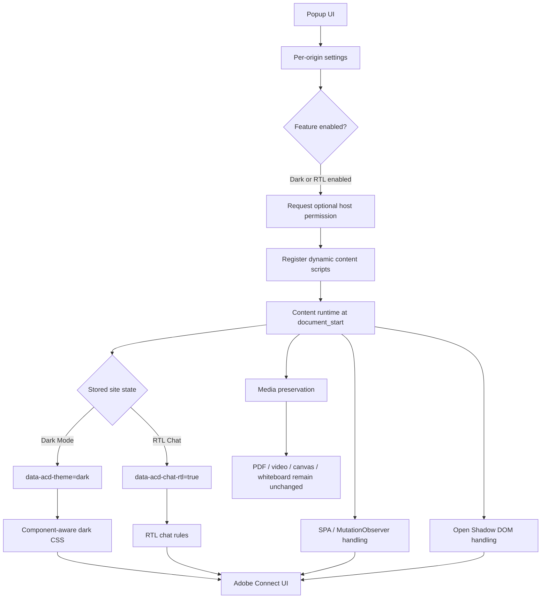

<div align="center">


# Adobe Connect Dark

### Premium dark mode + RTL chat for Adobe Connect

A source-driven Chrome / Edge extension that modernizes Adobe Connect without recoloring the content you actually came to see.

[](#)
[](#)
[](#)
[](#)
[](#)

<br>


<br>

**Dark Mode · RTL Chat · Per-site permissions · Dynamic SPA support · Media-safe theming**

</div>

<div align="center">

[Installation](#installation) •
[Usage](#how-to-use) •
[Features](#highlights) •
[RTL Chat](#rtl-chat-behavior) •
[Troubleshooting](#troubleshooting)

</div>
---

## Why this project exists

Adobe Connect is still widely used for classes, meetings, webinars, and recorded sessions, but long sessions in a bright interface can be tiring—especially when the surrounding browser and operating system are already dark.

**Adobe Connect Dark** adds a carefully scoped dark interface while preserving the original appearance of shared content such as PDFs, slides, whiteboards, video, and screen sharing.

It is deliberately **not** a page-wide color inversion filter. The extension combines explicit, source-derived Adobe Connect component styling with a conservative fallback layer for unknown UI surfaces.

It also includes an independent **RTL Chat Text** mode for Persian and Arabic users.

---

## Features

| Feature | What it does |
| --- | --- |
| **Premium Dark Mode** | Applies a layered, restrained dark theme to Adobe Connect UI surfaces |
| **RTL Chat Text** | Makes chat sender/message flow right-to-left while preserving timestamps and controls |
| **Per-site settings** | Dark Mode and RTL Chat are stored independently for each origin |
| **Permission on demand** | Host access is requested only when you enable a feature for the current site |
| **Adobe Connect Central support** | Styles navigation, search, Calendar Week/Month/Activity, Reports, forms, tables, dialogs, and more |
| **Meeting / Recording support** | Styles pods, Chat, Attendees, Video chrome, Share chrome, playback controls, sidebars, menus, and dialogs |
| **SPA-aware theming** | Handles dynamically mounted Adobe Connect components via MutationObserver |
| **Open Shadow DOM support** | Injects compatible styling into supported open shadow roots |
| **Media preservation** | Keeps PDFs, slides, video, screen sharing, canvas content, and whiteboards visually intact |
| **Self-healing registration** | Reconciles saved state, permissions, and dynamic content-script registrations on install/startup |
| **No telemetry** | The current extension code contains no analytics, telemetry, or remote-code loading |

---

## What stays untouched

The extension follows one core rule:

> **Theme the application, not the user's content.**

The following content is intentionally protected from darkening or inversion:

- PDF pages
- Presentation slides
- Webcam/video streams
- Screen sharing
- Canvas-rendered content
- Whiteboard drawings
- Images and embedded media

This is why a PDF can remain white while the Adobe Connect pod and surrounding workspace are dark.

---

## Installation

### Google Chrome

1. Download or clone this repository.
2. Open:

   ```text
   chrome://extensions
   ```

3. Enable **Developer mode**.
4. Click **Load unpacked**.
5. Select the project folder containing `manifest.json`.
6. Pin **Adobe Connect Dark Mode** from the Extensions menu if desired.

### Microsoft Edge

1. Download or clone this repository.
2. Open:

   ```text
   edge://extensions
   ```

3. Enable **Developer mode**.
4. Click **Load unpacked**.
5. Select the project folder containing `manifest.json`.

> No build step is required for unpacked development use.

---

## Usage

Open an Adobe Connect site and click the extension icon.

The popup exposes two independent per-site controls:

### Dark Mode

Enables the dark interface for the current Adobe Connect origin.

### RTL Chat Text

Enables right-to-left text flow for Persian / Arabic chat while keeping the surrounding Chat Pod layout stable.

### Feature combinations

| Dark Mode | RTL Chat | Result |
| :---: | :---: | --- |
| Off | Off | Native Adobe Connect |
| On | Off | Dark theme only |
| Off | On | Native Adobe styling + RTL chat text |
| On | On | Dark theme + RTL chat text |

The popup status becomes **Active** when either feature is enabled.

### Reset Site

**Reset Site** restores the current origin to its default state by:

- disabling Dark Mode
- disabling RTL Chat
- removing the origin from extension storage
- unregistering the dynamic content script for that site
- revoking the optional host permission for that origin

---

## RTL Chat behavior

RTL Chat is intentionally scoped to chat text rather than mirroring the entire interface.

When enabled, it applies RTL behavior to:

- message sender names
- message content
- the chat message flow
- compose / typing areas
- placeholder alignment

It intentionally leaves these UI elements structurally unchanged:

- timestamps
- Chat tabs
- Send button placement
- menus and icons
- scrollbars
- the overall Adobe Connect pod layout

### Mixed Persian / English text

The message rules are bidi-safe, so mixed content remains readable:

```text
این الگوریتم از Q-learning استفاده می‌کند.
```

```text
جلسه ساعت 10:30 AM شروع می‌شود.
```

```text
https://example.com را باز کنید.
```

The extension does not rewrite chat strings or use `bidi-override`.

---

## Adobe Connect coverage

The current styling is developed primarily against the **Adobe Connect 11.2.x HTML5 web client and Recording UI**.

### Adobe Connect Central

Explicit styling includes:

- Legacy global navigation
- Search controls
- Main application layout
- Primary / secondary navigation
- Calendar Week view
- Calendar Month view
- Calendar Activity view
- Current / past / future day states
- Calendar events, sidebars, and popovers
- Reports cards and states
- Forms and inputs
- Tables
- Menus
- Dialogs and popovers

### Meeting / Recording client

Explicit styling includes:

- Meeting / Recording shell
- Pod chrome and pod headers
- Pod control buttons
- Chat Pod
- Chat tabs and compose area
- Attendees Pod
- Hosts / Presenters / Participants sections
- Participant rows and states
- Video Pod chrome and empty states
- Share / PDF surrounding UI
- Recording playback bar
- Progress rail and played progress
- Volume UI
- Recording event/index sidebar
- Notes Pod
- Files Pod
- Web Links Pod
- Poll Pod
- Adobe Spectrum controls
- Menus, dialogs, fields, tabs, and tree views

---

## Permissions & privacy

The extension uses a **permission-on-demand** model.

### Manifest permissions

| Permission | Why it is used |
| --- | --- |
| `storage` | Stores per-origin Dark Mode and RTL Chat preferences |
| `activeTab` | Reads/interacts with the currently active tab when the popup is used |
| `scripting` | Dynamically registers or injects the extension runtime for enabled sites |

### Optional host access

The manifest declares:

```json
"optional_host_permissions": [
  "http://*/*",
  "https://*/*"
]
```

This does **not** grant automatic access to every website.

When a user enables Dark Mode or RTL Chat, the extension requests access only for the current origin, for example:

```text
https://connect.example.com/*
```

Settings are keyed by:

```text
protocol + hostname
```

So these are treated as different sites:

```text
http://connect.example.com
https://connect.example.com
```

### Local-only behavior

The current codebase does not include analytics, telemetry, remote API calls, or remote-code execution. Theme and RTL state are handled locally through Chrome extension APIs and the page DOM.

---

## How it works



### Dynamic runtime registration

Content scripts are registered per origin using IDs derived from protocol + hostname:

```text
acd_cs_<protocol>_<hostname>
```

They run at:

```text
document_start
```

and are registered with:

```text
allFrames: true
```

The service worker performs a startup/install reconciliation between:

1. saved feature state
2. currently granted host permissions
3. dynamically registered content scripts

If a saved site no longer has permission, stale state is removed. If permission exists but a required script registration is missing, it is repaired.

---

## Theme architecture

The theme uses two complementary layers.

### Layer 1 — conservative fallback

The theme engine can detect bright UI surfaces and dark text in unknown interface areas.

This layer is intentionally conservative and excludes sensitive content containers.

### Layer 2 — source-driven component styling

Known Adobe Connect components are styled explicitly using stable semantic selectors derived from the actual Adobe Connect interface.

Adobe's generated CSS-module hashes are **not hardcoded**. Rules use semantic class prefixes and structural scoping instead.

This provides more reliable coverage for:

- hover states
- active / selected states
- focus-visible states
- inline light backgrounds
- legacy image-based chrome
- Adobe Spectrum components
- dynamically mounted components

---

## Project structure

```text
.
├── manifest.json
├── background.js
├── content/
│   ├── content.js
│   ├── observer.js
│   └── theme-engine.js
├── popup/
│   ├── popup.html
│   ├── popup.css
│   └── popup.js
├── styles/
│   ├── variables.css
│   ├── base.css
│   ├── components.css
│   ├── connect-central.css
│   ├── adobe-connect.css
│   └── shadow-dom.css
├── icons/
│   ├── icon16.png
│   ├── icon32.png
│   ├── icon48.png
│   └── icon128.png
└── README.md
```

### Main files

| File | Responsibility |
| --- | --- |
| `manifest.json` | Manifest V3 configuration, permissions, popup, service worker, icons |
| `background.js` | Storage migration, self-healing dynamic registrations, toolbar badge state |
| `popup/popup.js` | Per-origin feature controls, permission requests, registration/reset flow |
| `content/content.js` | Synchronizes stored settings with the current document/frame |
| `content/observer.js` | Lightweight debounced SPA DOM observation |
| `content/theme-engine.js` | Theme lifecycle, CSS injection, fallback scanning, Shadow DOM handling, media exclusions |
| `styles/variables.css` | Design tokens and premium dark palette |
| `styles/base.css` | Base/fallback styling and content-preservation rules |
| `styles/components.css` | Shared menus, dialogs, form controls, buttons, and interactive states |
| `styles/connect-central.css` | Adobe Connect Central-specific styling |
| `styles/adobe-connect.css` | Meeting / Recording component styling and RTL Chat rules |
| `styles/shadow-dom.css` | Equivalent styles for supported open shadow roots |

---

## Storage model

Dark Mode sites are stored under:

```text
acd_enabled_sites
```

RTL Chat sites are stored under:

```text
acd_rtl_chat_sites
```

Each value is an object keyed by site origin:

```json
{
  "https://connect.example.com": true
}
```

The code also contains backward-compatible migration support from the older `acd_enabled_domains` format.

---

## Root state attributes

Dark Mode adds:

```html
<html data-acd-theme="dark">
```

RTL Chat adds:

```html
<html data-acd-chat-rtl="true">
```

The two features are deliberately independent.

---

## Development

### Local development loop

1. Modify the extension source.
2. Open `chrome://extensions` or `edge://extensions`.
3. Click **Reload** for the unpacked extension.
4. Reload the Adobe Connect page.
5. Test the affected UI state in the browser.

### Inspecting state

In DevTools Console:

```javascript
document.documentElement.getAttribute('data-acd-theme');
```

Expected when Dark Mode is enabled:

```text
dark
```

For RTL Chat:

```javascript
document.documentElement.getAttribute('data-acd-chat-rtl');
```

Expected when enabled:

```text
true
```

### Inspecting dynamic registrations

From the extension service worker console:

```javascript
chrome.scripting.getRegisteredContentScripts().then(console.log);
```

---

## Source-driven development guidelines

When adding support for a new Adobe Connect component:

1. Inspect the actual component DOM.
2. Identify stable semantic class prefixes, roles, IDs, or ARIA structure.
3. Inspect Adobe's native normal/hover/selected/focus behavior.
4. Prefer explicit component CSS over expanding the generic fallback.
5. Never hardcode CSS-module hash suffixes.
6. Keep selectors narrowly scoped.
7. Preserve user/session media.
8. Test both Dark Mode and RTL combinations.

For CSS modules such as:

```text
chatMessageSender--GENERATED_HASH
```

prefer resilient selectors such as:

```css
[class^="chatMessageSender--"],
[class*=" chatMessageSender--"]
```

instead of copying the generated hash.

---

## Manual QA checklist

Before publishing a change, test the real browser UI—not just selector presence.

### Feature combinations

- [ ] Dark OFF + RTL OFF
- [ ] Dark ON + RTL OFF
- [ ] Dark OFF + RTL ON
- [ ] Dark ON + RTL ON
- [ ] Dark ON → OFF without reload
- [ ] RTL ON → OFF without reload
- [ ] Reload page with settings already enabled
- [ ] Reopen popup and verify state synchronization
- [ ] Reset Site and verify origin access/state is removed

### Adobe Connect Central

- [ ] Global navigation
- [ ] Search
- [ ] Calendar Week
- [ ] Calendar Month
- [ ] Calendar Activity
- [ ] Reports
- [ ] Profile / legacy Central pages
- [ ] Menus, dialogs, forms, tables

### Meeting / Recording

- [ ] Pod shells and headers
- [ ] Hosts / Presenters / Participants hover states
- [ ] Participant rows
- [ ] Chat messages
- [ ] RTL sender ordering
- [ ] Mixed Persian / English RTL message
- [ ] Chat compose area
- [ ] Video Pod chrome
- [ ] Share / PDF Pod chrome
- [ ] Playback controls
- [ ] Keyboard focus-visible states
- [ ] Menus and dropdowns

### Media safety

- [ ] PDF colors unchanged
- [ ] Slides unchanged
- [ ] Video unchanged
- [ ] Canvas content unchanged
- [ ] Whiteboard unchanged
- [ ] Screen sharing unchanged

---

## Browser compatibility

| Browser | Status |
| --- | --- |
| Google Chrome | ✅ Primary target |
| Microsoft Edge | ✅ Supported |
| Other Chromium browsers | ⚠️ Likely compatible, not primary target |
| Firefox | ❌ Not currently targeted |

---

## Adobe Connect compatibility

The component map is currently optimized for **Adobe Connect 11.2.x**.

Because Adobe Connect releases can change DOM structure, CSS-module names, Spectrum components, and native state styles, future major versions may require selector updates.

The extension avoids generated class hashes to reduce that maintenance burden, but it cannot guarantee compatibility with every Adobe Connect release.

---

## Known limitations

- The theme is primarily validated against Adobe Connect 11.2.x.
- Shared documents and media are intentionally **not** darkened.
- RTL Chat is a manual per-site preference; there is no per-message automatic language-direction detection.
- Closed Shadow DOM cannot be styled from the extension in the same way as open Shadow DOM.
- Native Adobe Connect behaviors outside the theme/RTL scope are intentionally preserved. For example, the project does not override Adobe's own Recording Chat auto-scroll behavior.
- Cross-origin embedded content may require its own browser permission if it needs extension access.

---

## Troubleshooting

### Nothing changes after enabling Dark Mode

1. Confirm the popup shows the current site as **Active**.
2. Confirm browser permission was granted for the current origin.
3. Open `chrome://extensions` and reload the extension.
4. Reload Adobe Connect.
5. Verify `data-acd-theme="dark"` exists on `<html>`.

### RTL Chat is enabled but the entire Chat Pod is not mirrored

That is expected.

RTL mode intentionally changes text flow while preserving Adobe's native tabs, buttons, timestamps, icons, and layout.

### A PDF stays white

That is expected and intentional.

Only the Adobe Connect interface surrounding the document is themed.

### Dark Mode works in Central but a Meeting/Recording component looks wrong

Adobe Connect can differ between versions and server deployments. Capture the affected component's sanitized `outerHTML` and native styles, then add a narrowly scoped source-derived selector.

### The badge still says `ON`

The toolbar badge is active when **either** Dark Mode or RTL Chat is enabled for the current site.

Use **Reset Site** to clear both features and revoke the current origin permission.

---

## Security notes for contributors

Never commit diagnostic exports containing:

- session tokens
- authentication tickets
- cookies
- CSRF values
- meeting/recording IDs when sensitive
- private meeting URLs
- private chat content
- personal user information

The repository `.gitignore` already reserves common diagnostic/scratch locations, but contributors should still review `git status` before committing.

---

## Contributing

Contributions are welcome—especially for additional Adobe Connect versions, component coverage, accessibility, and browser compatibility.

Please keep changes aligned with the project's design principles:

- source-derived selectors over guesses
- component CSS over aggressive generic theming
- no generated CSS-module hashes
- no global color inversion
- no unnecessary global `!important`
- no layout redesign unless required for a real compatibility issue
- preserve PDFs, video, slides, whiteboards, and screen sharing
- distinguish static validation from real browser-render validation

A good bug report includes:

- Adobe Connect version, if known
- browser/version
- Central vs Live Meeting vs Recording
- Dark Mode state
- RTL Chat state
- sanitized screenshot
- sanitized affected DOM structure
- steps to reproduce

---

## Roadmap ideas

Potential future work—not commitments:

- additional Adobe Connect version profiles
- Chrome Web Store / Edge Add-ons packaging
- more automated regression coverage
- optional per-message direction detection
- improved accessibility auditing
- public sanitized screenshot gallery
- localization of the popup UI

---

## Release checklist

Before a public release:

- [ ] Verify `manifest.json` version
- [ ] Keep the popup-displayed version in sync with the manifest
- [ ] Run final Chrome QA
- [ ] Run final Edge QA
- [ ] Test all four Dark/RTL combinations
- [ ] Verify Central Week / Month / Activity
- [ ] Verify Reports
- [ ] Verify Meeting / Recording UI
- [ ] Verify RTL sender ordering
- [ ] Verify media preservation
- [ ] Add sanitized screenshots
- [ ] Review permissions
- [ ] Remove private diagnostic artifacts
- [ ] Verify Git history contains no sensitive snapshots
- [ ] Add an open-source `LICENSE`
- [ ] Write release notes

---

## License

A public open-source license is **not included yet**.

Before publishing this repository as open source, add a `LICENSE` file and update this section. A permissive license such as MIT is a common choice for browser-extension projects, but the final choice belongs to the project owner.

---

## Disclaimer

Adobe Connect is a product of Adobe.

**Adobe Connect Dark** is an independent browser extension and is not affiliated with, endorsed by, or distributed by Adobe.

Compatibility may change when Adobe updates the Adobe Connect web client.

---

<details>
<summary><strong>راهنمای سریع فارسی</strong></summary>

### نصب

1. وارد `chrome://extensions` یا `edge://extensions` شوید.
2. **Developer mode** را فعال کنید.
3. روی **Load unpacked** بزنید.
4. پوشه‌ای را انتخاب کنید که فایل `manifest.json` داخل آن قرار دارد.

### استفاده

- **Dark Mode**: تم تاریک را برای دامنه فعلی فعال می‌کند.
- **RTL Chat Text**: متن چت فارسی/عربی را راست‌به‌چپ می‌کند.
- هر دو قابلیت مستقل از یکدیگر هستند.
- تنظیمات برای هر دامنه به‌صورت جداگانه ذخیره می‌شوند.
- **Reset Site** تنظیمات همان دامنه را پاک می‌کند، اسکریپت ثبت‌شده را حذف می‌کند و دسترسی همان دامنه را پس می‌گیرد.

### نکته مهم

PDF، اسلاید، ویدیو، اسکرین‌شیر و وایت‌برد عمداً تغییر رنگ داده نمی‌شوند؛ فقط رابط کاربری Adobe Connect تم می‌گیرد.

</details>

---

<div align="center">

**A dark theme should change the interface—not the lesson, presentation, or meeting content.**

</div>
